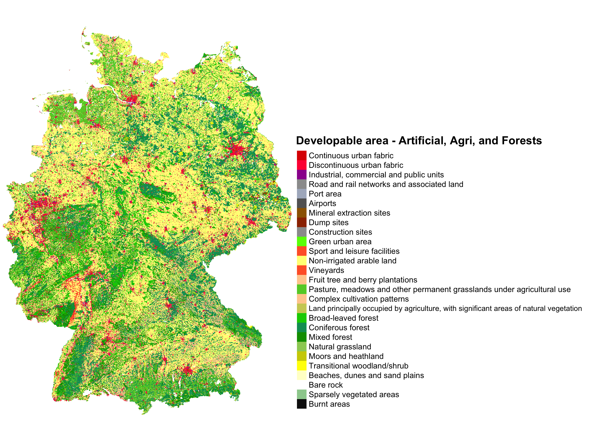

```{r global-opts, include=FALSE}
library(knitr)
library(data.table)
library(ggplot2)
library(cowplot)

opts_chunk$set(
  echo = FALSE,
  warning = FALSE,
  message = FALSE,
  fig.path = "output/figs/",
  fig.align = "center",
  dpi = 320,
  cache = FALSE
)

## ggplot global theme setting
font_size = 12
theme_set(cowplot::theme_cowplot(font_size))
theme_update(
  strip.background = element_rect(fill = NA),
  strip.text = element_text(face = "bold"),
  plot.title = element_text(hjust = .5, size = rel(1.1))
)

source("script/helpers/base_helpers.R")
source("script/helpers/helpers.R")
source("script/helpers/estimation_helpers.R")

dirMain <- function(path = NULL) {
  paste0("data/processed/main/", path)
}
```

```{r global-imports}
in_levels = fread_utf8("data/processed/main/main_in-levels.csv", keepLeadingZeros = TRUE)
in_changes = fread_utf8("data/processed/main/main_wide.csv", keepLeadingZeros = TRUE)
main = fread_utf8("data/processed/main/model-data.csv", keepLeadingZeros = TRUE)
setnames(main, "urban_rural_area", "urban_rural")
main[, unavail_frac := unavail_frac_2006][, dev_frac := dev_frac_2006]
constraints = fread_utf8(
  "data/processed/geodata/constraints.csv",
  keepLeadingZeros = TRUE
)

in_levels[, `:=`(ln_hpi = log(hpi), ln_hpi_single_fam = log(hpi_single_fam))]
```

```{r global-constants}
d1 = in_levels[
  year %in% c(2008, 2019),
  .(
    p = mean(exp(ln_hpi), na.rm = TRUE),
    h = sum(total_buildings, na.rm = TRUE)
  ), year
] |>
  dcast(. ~ year, value.var = c("p", "h"), sep = "")
```

```{r construction-stats-since-1995}
# construction completions and permits,  buildings & apartments
vs = c("permits_", "completions_")
complet_permit = paste0(dirMain(),
                        "total_apartments-buildings_completions-permits.csv") |>
  fread_keepzeros(select = c(
    "did", "year",
    paste0(vs, "total_buildings"),
    paste0(vs, "floorspace"),
    paste0(vs, "1-apart-building")
  ))

stock = fread_keepzeros(paste0(dirMain(), "residential_stock-floorspace.csv"),
  drop = "name"
)[, .(did, year, total_buildings, `1-apart-building`, floorspace)]

since95 <-
  merge(complet_permit, stock, c("did", "year"))[year < 2020, .(
    did, year,
    # all-homes
    buildings = total_buildings,
    floorspace,
    permits = permits_total_buildings,
    completions = completions_total_buildings,
    # single-family homes
    single_fam = `1-apart-building`,
    single_fam_floorspace = floorspace * `1-apart-building` / total_buildings,
    single_fam_permits = `permits_1-apart-building`,
    single_fam_completions = `completions_1-apart-building`
  )] |>
  reshape(
    varying = list(
      c("buildings", "single_fam"),
      c("floorspace", "single_fam_floorspace"),
      c("permits", "single_fam_permits"),
      c("completions", "single_fam_completions")
    ),
    idvar = c("did", "year"),
    direction = "long",
    times = c("all", "single-family"),
    timevar = "house_type"
  ) |> 
  {
  \(.x) .x[, lapply(.SD, mean, na.rm = TRUE), .(house_type, year), .SDcols = !"did"]
  }()
since95[
  order(house_type, year),
  `:=`(
    flow = buildings - shift(buildings, fill = NA),
    # t's completions are t-1's permits
    completions = shift(completions, -1L, fill = NA)
  ), .(house_type)
]

since95[year == 2011, flow := NA] # removing an outlier (because of Census 2011)

since95_tot = complet_permit[, .(did, year,
  permits = permits_total_buildings, completions = completions_total_buildings
)][stock[, .(did, year, buildings = total_buildings)], on = c("did", "year")][
  ,
  I(.(
    year = year, buildings = buildings, flow = buildings - shift(buildings),
    permits = permits, completions = shift(completions, -1)
  )), .(did)
][, lapply(.SD, sum, na.rm = TRUE), year, .SDcols = !"did"] 
since95_tot[flow==0, flow:=NA]
```

```{r before-after-comparison}
# construction outlook before after the study period
ba_study = since95[year <= 2019,
  .(permits = mean(permits, na.rm = TRUE), completions = mean(completions, na.rm = TRUE)),
  .(period = fcase(
    year %between% c(2008, 2019), "2008-2019", year %between% c(1995, 2007), "1995-2007"
  ))
]
```

```{r verification, results='asis'}
# in_dir("", source("script/model/verify-estimation.R"))
coefs = fread('output/elasticity-estimates_checked.csv')
coefs_single = fread('output/elasticity-estimates-single-family_checked.csv')
```

```{r global-imports-estimates}
## pars
iqr = list()
iqr$dev = quantile(main$dev_frac_2006, c(1/4, 3/4), names = FALSE)
iqr$unavail = quantile(main$unavail_frac_2006, c(1/4, 3/4), names = FALSE)

pars = main[, .(ave.dev = mean(dev_frac_2006), ave.unavail = mean(unavail_frac_2006))]

# floorspace elasticity ----

## case 1 ----
eps.fs.1 = coefs[.("Floorspace", "case.1"), on = c("qmeasure", "case"), dln_hpi]
eps.u.1 = coefs[.("Units", "case.1"), on = c("qmeasure", "case"), dln_hpi]

## case 2 ----
est.fs.2 = coefs[.("Floorspace", "case.2"), on = c("qmeasure", "case"), 
                 .(dln_hpi, `dln_hpi:dev_frac`)]
est.fs.2 = setNames(as.list(est.fs.2), c('vareps', 'b_dev'))
eps.fs.2 = with(est.fs.2, vareps + b_dev * pars$ave.dev)

## case 3 ----
est.fs.3 = coefs[.("Floorspace", "case.3"), on = c("qmeasure", "case"), 
                 .(dln_hpi, `dln_hpi:unavail_frac`)]
est.fs.3 = setNames(as.list(est.fs.3), c('vareps', 'b_unavail'))
eps.fs.3 = with(est.fs.3, vareps + b_unavail * pars$ave.unavail)

## case 4 ----
est.fs.4 = coefs[.("Floorspace", "case.4"), on = c("qmeasure", "case"), 
                 .(dln_hpi, `dln_hpi:dev_frac`, `dln_hpi:unavail_frac`)]
est.fs.4 = setNames(as.list(est.fs.4), c('vareps', 'b_dev', 'b_unavail'))

eps.fs.4 = with(est.fs.4, 
                vareps + b_dev * pars$ave.dev + b_unavail * pars$ave.unavail)
eps.fs.4.dev.q1 = with(est.fs.4, 
                       vareps + b_dev * iqr$dev[1] + b_unavail * pars$ave.unavail)
eps.fs.4.dev.q3 = with(est.fs.4, 
                       vareps + b_dev * iqr$dev[2] + b_unavail * pars$ave.unavail)

eps.fs.4.unavail.q1 = with(est.fs.4, 
                           vareps + b_dev * pars$ave.dev + b_unavail * iqr$unavail[1])
eps.fs.4.unavail.q3 = with(est.fs.4, 
                           vareps + b_dev * pars$ave.dev + b_unavail * iqr$unavail[2])

# units elasticity ----
est.u.4 = coefs[.("Units", "case.4"), on = c("qmeasure", "case"),
  .(vareps = dln_hpi, b_dev = `dln_hpi:dev_frac`, b_unavail = `dln_hpi:unavail_frac`)
]

```

```{r district-elasticity}
elasticity <- data.frame(
  case2 = with(coefs[.("Floorspace", "case.2"),
    on = c("qmeasure", "case"),
    .(e = dln_hpi, e1 = `dln_hpi:dev_frac`)
  ], e + e1 * main$dev_frac),
  case3 = with(coefs[.("Floorspace", "case.3"),
    on = c("qmeasure", "case"),
    .(e = dln_hpi, e1 = `dln_hpi:unavail_frac`)
  ], e + e1 * main$unavail_frac),
  case4 = with(coefs[.("Floorspace", "case.4"),
    on = c("qmeasure", "case"),
    .(e = dln_hpi, e1 = `dln_hpi:dev_frac`, e2 = `dln_hpi:unavail_frac`)
  ], e + e1 * main$dev_frac + e2 * main$unavail_frac)
)
```

(ref:atlas-germany) the @atlasde2022

(ref:rwigeored) @rwi2020

<!--chapter:end:index.Rmd-->

# Abstract {.unnumbered}

The study estimates the housing supply elasticity and the impact of geographic constraints in Germany from 2008-2019 using the Bartik instrument. The results show that the housing supply is, on average, inelastic, with a floorspace elasticity of `r round(eps.fs.1,2)` and a units elasticity of `r round(eps.u.1,2)`. The study also reveals that geographical constraints partially affect the housing supply elasticity across districts. Notably, high development intensity decreases the elasticity, while the unavailability of land for development due to restrictive geography has no significant impact on the housing supply elasticity. The housing supply elasticity estimates may prove useful for calibrating quantitative urban models in Germany.

JEL-Code: R310\
Keywords: House prices, housing supply, housing supply elasticity

```{=tex}
\pagenumbering{gobble} % Remove page numbers (and reset to 1)
\pagebreak
```

<!--chapter:end:00-abstract.Rmd-->

# Introduction

\pagenumbering{arabic} <!-- % Arabic page numbers (and reset to 1) -->

The price elasticity of housing supply is a key parameter in urban economics because it drives the congestion externalities and governs urban growth dynamics. An inelastic supply of land or housing means that any positive change in housing demand or location due to a positive productivity or amenity shock translates into higher prices---a major source of urban disutility---rather than higher quantities. On the contrary, if housing is supplied more elastically, we might expect smaller price changes and larger adjustments in city sizes. Moreover, inelastic supply aggravates house price differences across regions, affecting inter-regional labor mobility, and may constrain housing affordability in cities and regions, particularly in the big and growing ones. Thus, the housing supply elasticity is central to understanding the long-term development of cities and regions [@combes-etal2019; @glaeser-etal2006; @saks2008; @lerbs2014].

Over the past two decades, house prices have risen in cities worldwide, often due to a combination of strong and growing demand and a limited supply of new housing. Significant variations in the level and growth of house prices across cities and locations within cities and regions have been recorded [@glaeser2020; @hilber-mensa2021]. Undoubtedly, an unresponsive housing supply can lead to higher house prices. However, examining what limits the housing supply and why may take more work. For example, in the US, house price gaps in rural and urban areas are much larger than the gaps in construction costs which is understood as a reflection of the difficulty of building new houses, especially in dense urban cores [@glaeser2020]. While building new houses may help reduce house prices and alleviate affordability issues, answering why some cities and regions can build more houses more flexibly than others in response to the growing demand for housing is essential. More precisely, why do changes in demand for housing, triggered by productivity or amenity shocks, increase house prices rather than inducing more construction activities and city growth in some cities and not others?

This study empirically examines these questions by analyzing the growth of housing supply and house prices between 2008-2019 across the 401 German districts.[^01-intro-1] More precisely, I estimate the price elasticity of housing supply from a productivity or amenity shock induced response in housing supply. The main source of variation exploited for identifying the housing supply elasticity parameter is a @bartik1991 labor demand shock, which has been widely used in the literature (for example, @saiz2010 and @baumsnow-han2019) as a proxy for demand. As such, average housing supply elasticity estimates reflect variations in housing demand shocks due to changes in labor demand over time across districts.

[^01-intro-1]: There are 401 districts ("Kreise" in German) according to the 2019 end-of-the-year [(31.12.2019)](https://www.destatis.de/DE/Themen/Laender-Regionen/Regionales/Gemeindeverzeichnis/Administrativ/Archiv/Verwaltungsgliederung/31122019_Jahr.html) administrative structure breakdown.

However, construction costs or productivity, existing land development, and land use regulations may also influence housing supply differences. These factors can also mediate the responsiveness of the housing supply to changes in housing demand. Evidently, housing supply variations across districts are high due to differences in existing development intensity and land availability constraints. Therefore, parameterizing the housing supply elasticity with these observed housing supply heterogeneities allows us to get elasticity estimates at the district level and captures the importance of these factors in mediating the relationship between housing quantity and price.

<!-- > *What makes this paper different?* -->

Much of the existing evidence on the housing supply elasticity comes from the US housing market, but the literature is limited for other countries due to data availability, particularly for Germany. To my knowledge, only @lerbs2014 estimated the housing supply elasticity for Germany, using a dynamic panel data model from new construction permits of single-family homes for 2004-2010. By adopting the recent approaches in the literature [@saiz2010; @hilber-vermeulen2016; @baumsnow-han2019], this paper presents the German housing market's peculiarities regarding the housing supply elasticity.[^01-intro-2] For doing so, I leverage a detailed unique house price data set by @rwi2020 covering the whole of Germany available for 2007 onward. Furthermore, in line with the housing production literature, I use total residential floorspace over housing units as the main measure of housing quantity as it better captures the true level of housing supply [@baumsnow-han2019; @epple-etal2010].[^01-intro-3]

[^01-intro-2]: The German housing market is known for its stability, pro-tenant rental laws, moderate rental income taxes, low interest rates, recent fundamental supply shortages, and stiff land use regulations ([German Property Market Outlook 2021, Deutsche Bank AG, accessed August 10, 2022](https://www.dbresearch.com/PROD/RPS_EN-PROD/PROD0000000000517463/Outlook_for_the_German_residential_property_market.pdf?undefined&realload=OGCzKhorommVYqr3DKzCKCT/4~0T75BVVmGs5XHbQs3QdBI~xyjvWG3i2CAeU6MJ), [Global Property Guide, accessed August 12, 2022](https://www.globalpropertyguide.com/Europe/Germany)). Moreover, it was one of the few housing markets that experienced less house price volatility during the 2008-2009 financial crisis. Because of these unique features (subtle nuances), studying this market, particularly concerning housing supply and elasticity differences across districts, would be a great addition to the literature.

[^01-intro-3]: In the literature, housing supply has been measured or proxied by several variables, including housing units (stock), new construction permits, completions, and starts, and the number of households (e.g., @saiz2010).

Using a reduced form approach, I recover the housing supply elasticity as the impact of housing demand-induced growth in house prices on residential floor space growth over 2008-2019. Following the housing production literature, I derive a housing supply function incorporating local variations in construction costs or productivity and land availability. This allows writing the housing supply elasticity as a function of the same factors. Finally, I estimate the housing supply elasticity via a two-stage least squares (2SLS) estimation using predicted employment growth as an instrument for house price growth.

The data show that most districts in Germany have experienced substantial growth in house prices, an about `r round(100 * (d1$p2019/d1$p2008 - 1))`% change between 2008 and 2019, on average. Urban districts, in particular, have experienced slightly higher growth than rural districts, but there is little difference in price growth between the West and East German districts. In contrast, the housing supply growth has been weak across German districts, about `r round(100 * (d1$h2019/d1$h2008 - 1))`%, on average. New construction permits and completions have been continuously declining since 1995, gradually rising after 2009, yet the 2008-2019 levels remain far below the late 1990s and early 2000s.

Consequently, districts, on average, have been supply-inelastic. According to the baseline results, on average, a district has about `r round2(eps.fs.1)` elasticity in floorspace, `r round2(eps.u.1)` in units. That means, over the 2008-2019 period, a 10% increase in house prices has generated a `r 10*round2(eps.fs.1)`% growth in residential floorspace, on average, keeping other things constant. These estimates are similar to what @lerbs2014 found for 2004 to 2010 (a short-run elasticity of 0.25 and a long-run value of `r round2(0.25/(1-0.37))`).[^01-intro-4] @baumsnow-han2019 also found housing supply elasticity estimates in a similar range for census tracts in the US for 2000-2010.[^01-intro-5]

[^01-intro-4]: Apart from the time periods, however, estimates in this paper may be different from @lerbs2014 estimates due to differences in the empirical methods employed. First, permits are used as housing quantity measure, as opposed to residential floorspace used in this paper. Second, the price data used in the two papers are different.

[^01-intro-5]: The authors estimate the housing supply elasticity to be in a range of 0.3-0.5 aggregated to the Metropolitan Statistical Area (MSA) level (see (3) and (8) columns of Table 6 and Table 11 in the Appendix of their paper).

The baseline specification conceals district heterogeneity since it does not allow the housing supply elasticity to vary across districts. Instead, the main specifications allow housing supply elasticities to vary across districts as a function of housing supply constraints. This is achieved by interacting price growth with fractions of already developed land and land that cannot be developed because of steep slopes and water bodies. According to the results, only land development intensity significantly constrains the housing supply elasticity in German districts, while land undevelopability due to restrictive geography has no significant impact. Land development intensity lowers the housing supply elasticity by about `r round2(abs(est.fs.4$b_dev))`. Moving in the interquartile range of existing development intensity (`r paste(sprintf("%.1f%%", 100 * iqr$dev), collapse = ", ")`) reduces the floorspace elasticity by `r round2(abs(est.fs.4$b_dev * diff(iqr$dev)))`, from `r round3(est.fs.4$vareps + est.fs.4$b_dev * iqr$dev[1])` to `r round3(est.fs.4$vareps + est.fs.4$b_dev * iqr$dev[2])`.

Finally, this paper provides robust housing supply elasticity estimates for Germany from 2008-2019. The housing supply elasticity estimates may prove useful for calibrating quantitative urban or regional models in Germany, which previously relied heavily on estimates for other markets. In addition, the study's utilization of supply constraints in Germany, precisely the measurement of undevelopable land constructed from elevation and land cover data, can be valuable for future studies.

<!--chapter:end:01-intro.Rmd-->

# Literature

<!-- > [*Prepare a table that summarizes the existing literature: indicate what housing supply measure used, time period, intervals of estimates, spatial scale, and so on*] -->

This study builds on a growing body of literature examining the determinants of housing supply. The existing literature presents strong evidence regarding the impact of supply constraints on house prices and the housing supply elasticity in the US housing markets [@glaeser-gyourko2005; @saiz2010; @paciorek2013; @baumsnow-han2019]. In other markets, the literature is somewhat limited, except for a few notable studies, such as @hilber-vermeulen2016 and @büchler2021, which looked at the UK and Swiss markets, respectively. Much of the existing work looks at differences between cities concerning spatial scale. Few studies take on within cities and regions, such as neighborhoods, at a much finer spatial scale, for example, @baumsnow-han2019.

@glaeser-gyourko2005, @saiz2010, @paciorek2013, @hilber-vermeulen2016, and @baumsnow-han2019 explore the relationship between housing prices and various factors such as regulatory approval, geography, and land availability. @glaeser-gyourko2005 argues that changes in house prices in the US appear to result from a changing regulatory regime that has made large-scale development increasingly difficult in expensive regions of the country. @saiz2010 uses a variation of the Alonso-Mills-Muth model to show that land-constrained metro areas should have more expensive housing and higher amenities or productivity. Most areas widely regarded as supply inelastic were found to be severely land-constrained by their geography, and highly regulated areas were found to be geographically constrained. @paciorek2013 focuses on the relationship between supply constraints and house price volatility and indicates that permit delays and marginal costs of new investment explain much of the observable differences in elasticity across markets. @hilber-vermeulen2016 finds regulatory constraints to be the causal impact of various long-run supply constraints on house prices in England. Finally, @baumsnow-han2019 provides a comprehensive characterization of housing supply elasticities for residential neighborhoods in 306 US metro areas and finds that distance from urban centers, initial development density, topography, and zoning regimes are among the most important determinants of local housing supply.

In summary, the literature on the impact of supply constraints on house prices and supply is extensive in the US but limited for other countries [@hilber-vermeulen2016]. There is strong evidence stressing that both geographical constraints [see @saiz2010; @paciorek2013] and regulatory constraints [see @glaeser-gyourko2005; @paciorek2013; @gyourko-etal2021; @glaeser2020] explain much of the rapid house price growth across cities and markets in the US, as well in the UK [@hilber-vermeulen2016]. In most of the US studies, Wharton Residential Land Use Regulatory Index (WRLURI 2006 or 2018) has been exclusively used as a measure of regulatory restrictiveness. In contrast, @hilber-vermeulen2016 used a data set that includes direct information on actual planning decisions to measure regulatory restrictiveness. Regarding geographic constraints, mainly the degree of land development and unavailability, measures constructed from digital elevation models and land cover classes have been used. In the literature, housing supply is measured by several variables, including housing units (stock), construction permits, completions or starts, and household size. The housing production literature suggests using housing services, which can be proxied by floorspace, as a better measure, as used in @baumsnow-han2019. @bartik1991 is widely used as a main source of variation for identifying the housing supply elasticity parameter.

<!--chapter:end:02-literature.Rmd-->

# Method

I begin with a simple theoretical derivation of the supply of housing on a fixed plot of land and a simple aggregation to the district level. Then, the empirical implementation section discusses how the housing supply elasticity is estimated using the @bartik1991 shocks as an instrument for housing demand.

## Model

This section demonstrates the derivation of the local housing supply function, following the housing production function literature. Importantly, the model demonstrates how the local housing supply and housing supply elasticity can be written as a function of supply determinants, in particular geographical or physical constraints.

### Housing supply

#### A simple model of district housing supply {.unnumbered}

A competitive developer combines a fixed amount of land $\overline{T}$ and non-land inputs $K$, which I simply call capital, to produce housing $H$ via a Cobb-Douglas technology:\begin{equation}
    H = H(A, \overline{T}, K) = A \overline{T}^{\alpha} K^{1-\alpha}
    (\#eq:cobb),
\end{equation} where $\alpha \in (0, 1)$. $A$ captures supply heterogeneity across parcels due to local labor costs, productivity, geography, or ease of construction differences.[^03-method-1]

[^03-method-1]: $K$ captures a composite of all inputs for housing production other than land, which can broadly be labor and materials.

A representative builder maximizes profit by choosing capital $K$ over a fixed parcel of land $\overline{T}$ $$\begin{aligned}
\Pi &= P(x) \cdot H - R - P^K\cdot K,
\end{aligned}$$where $R$ denotes the endogenous price of land of size $\overline{T}$, and $P^K$ is the price of capital which is assumed to be invariant across parcels and locations and normalized to unity. The price of a unit of housing developed on a parcel of size $\overline{T}$ is given by $P$ and depends on $x$, a vector of observed or unobserved parcel or location characteristics that reflect the housing demand on the parcel.[^03-method-2]

[^03-method-2]: The full detail of this section is delegated to the Appendix; see Section \@ref(supplyapp).

Builder's profit maximization delivers the factor demand for capital $K$.[^03-method-3] $$\begin{aligned}
 K^* = \Bigl((1-\alpha)AP(x)\Bigr)^{\frac{1}{\alpha}}\overline{T}\equiv K^*(P(x), \overline{T}, A) \end{aligned}$$

[^03-method-3]: Since land is fixed, the builder chooses capital to maximize profit.

By substituting the factor demand equation for capital back into the housing production function \@ref(eq:cobb), the per parcel supply function can be written as $$
\begin{aligned}
H(A, \overline{T}, K^*(P(x), \overline{T}, A))=\mu A^{\frac{1}{\alpha}}{P(x)}^{\frac{1-\alpha}{\alpha}}\overline{T} \equiv H^S(P(x), A)\,,\quad \text{with } \mu = (1-\alpha)^{\frac{1-\alpha}{\alpha}}.\end{aligned}\,$$ In log-linear form, \begin{align}
\ln H^S(P(x), A, \overline{T}) &= \ln \mu + \frac{1}{\alpha}\ln A + \underbrace{\Bigl(\frac{1-\alpha}{\alpha}\Bigr)}_{\varepsilon}\ln P(x) + \ln \overline{T}.
(\#eq:hs)
\end{align} This shows that the supply of housing developed on a parcel depends on local supply heterogeneity $A$, local housing demand conditions captured by $P(x)$, and on the size of the parcel $\overline{T}$.

Following @baumsnow-han2019, aggregation of the housing supply on a parcel in \@ref(eq:hs) over all developed parcels in the district delivers the total supply of housing in the district. Let $\mathcal{L}_{i}$ denote the total (developable) land endowment of district $i$ and $\Lambda_i (P_i)$ the fraction of partitioned parcels that are developed in $i$, then the stock of developed land in $i$ is defined as $\mathcal{T}(P_i) = \Lambda_i(P_i) \cdot \mathcal{L}_{i}$. The implicit district-level aggregate housing supply function $S_i(P_i(x))$ can then be defined as the product of the (average) housing supply per parcel and the stock of developed land: \begin{align}
S_i(P_i) = H_i^S(P_i, A_i)\cdot \mathcal{T}_{i}(P_i)\\ 
\ln S_i(P_i) = \Bigl[\ln \mu_i + \frac{1}{\alpha}\ln A_i + \varepsilon\ln P_i \Bigr]+ \Bigl[\ln\Lambda_i(P_i) + \ln\mathcal{L}_i\Bigr]
(\#eq:agg-hs)
\end{align}

Differentiating \@ref(eq:agg-hs) with respect to $\ln P$ delivers the housing supply elasticity, \begin{equation}
\varepsilon^S_{i} \equiv \varepsilon + \frac{\partial \ln\Lambda_i(P_i)}{\partial \ln P_i},
(\#eq:elasticity)
\end{equation} where the first term captures the intensive margin of development (floorspace per parcel) and the second reflects the extensive margin (parcel development).

Districts with more developable (more flat or less rugged) land, low initial level of development density, and unrestrictive regulation may respond more along the extensive margin, increasing the level of land development. In contrast, districts that have a high level of existing development (high built-up) or are restricted by their geography or by restrictive land regulation may respond along the intensive margin, increasing floorspace per parcel.

### Housing demand

The canonical housing demand is derived from a utility maximization problem of a representative household living in district $i$ who consumes final goods $C$ priced at 1 and a unit of housing $H_i$ priced at $P_i(x)$.$$\begin{aligned}
\underset{C,H}{\max}\, U(C, H) = \theta H_i^\beta C_i^{1-\beta}\\
\text{s.t.}\quad w_i = C_i+P_i(x)\cdot H_i\,,
\end{aligned}$$

where $w_i$ denotes average wage or productivity in $i$.[^03-method-4] The first order condition for utility maximization with respect to $H$ delivers the housing demand function $$
\begin{aligned}
H^{*}_i(P_i(x), w_i) &= \beta\frac{w_i}{P_i(x)} \equiv H^d_i(P_i(x), w_i).
\end{aligned}
$$

[^03-method-4]: For simplicity, I assume that market imperfections are minimal such that workers earn wages equal or proportional to their productivity.

Assuming that locations within district $i$ are perfect demand substitutes for given values of parcel characteristics, then $P_{i}$ representing the average price of housing in the district, summing up over the housing consumption of all the residents $N$ of $i$, the log aggregate housing demand function for district $i$ can be written as \begin{equation}
\ln P_{i}=\ln \beta + \ln w_{i}-\ln H_{i}^{d} + ln N_{i} (\#eq:agg-hd).
\end{equation}

The housing demand equation in \@ref(eq:agg-hd) shows how exogenous productivity ($w_i$) changes can be used as demand shifters for identifying the housing supply elasticity.[^03-method-5]

[^03-method-5]: Higher levels of productivity are associated with higher levels of economic development and income, which can lead to increased demand for housing by attracting more people to an area [@glaesergottlieb2009; @glaeser2008]. This increased demand can drive up local house prices, as people are willing to pay more for housing in areas with strong job market opportunities and higher wages. Home builders will react to the increased demand and higher prices by building new houses, other things held constant.

## Empirical implementation

Fundamental to recovering the housing supply elasticity $\varepsilon$ is finding an exogenous shifter that comes from the housing demand function \@ref(eq:agg-hd). This shifter can be used as an instrument for house prices provided it is uncorrelated with supply shifters (such as construction costs or productivity).

The main estimation equation is the housing supply equation \@ref(eq:agg-hs) in discrete changes \begin{equation}
\Delta\ln H_i^S =  a^S_i + \varepsilon^S_i\Delta\ln P_i + \boldsymbol{\beta}\mathbf{X}^S_i + u^S_i
(\#eq:main),
\end{equation}where $i$ indexes districts across Germany and changes are computed from long (log) differences between 2008-2019, and $\mathbf{X}$ includes a set of district controls.[^03-method-6] The parameter vector of interest is $\varepsilon^S_i=\mathbf{Y}_i\varepsilon$. Following @saiz2010 and @baumsnow-han2019, such a setup allows us to compute an elasticity estimate for each district $i$. For doing so, $\varepsilon^S_i$ can be defined as a function of observed district supply characteristics $\mathbf{Y}_i$ such as undevelopable fraction of land, level of existing land development (developed fraction), and regulation. First, as a baseline specification, and following @saiz2010, I start with a common price elasticity of housing supply across all districts, i.e., $\varepsilon^S_i=\varepsilon^S \;\forall i$, which corresponds to $\varepsilon$ in the aggregate housing supply function in equation \@ref(eq:agg-hs). Then, I consider estimating the housing supply elasticities that vary across districts as a function of these observed district supply conditions.

[^03-method-6]: The control variables include construction and labor costs, housing supply constraints, and dummy variables for whether the district is urban and in West Germany. Depending on the variable type, controls are either in levels or logarithms.

### The housing supply elasticity as a function of supply constraints {#decompose}

In this section, I demonstrate how land unavailability (due to geographical constraints), the level of existing land development, and restrictive land use regulations impact the housing supply elasticity. I follow the reasoning by @saiz2010 and @baumsnow-han2019 as to why these constraints mediate the impact of growth in house prices on housing supply.

As districts are inherently different, they will respond differently if they receive the same amount of housing demand shock. More precisely, the same level of demand shock will produce different results in housing supply growth because of differences in factors that affect housing supply. For instance, districts that are more flat, growing, and less regulated are expected to react more to a given change in housing demand, other things held constant. Therefore, the extent to which changes in housing demand translate into more construction rather than higher prices depends on physical and regulatory factors. More land availability (for instance, through rezoning) shifts the supply curve outward. The question is whether land and regulatory constraints also impact the housing supply elasticity, i.e., whether $\varepsilon^S_i$ is a function of land availability, regulation, and development intensity.

The first hypothesis I test is whether districts that have a high level of existing development, measured by the fraction of land that is already developed (*Developed*), have more inelastic housing supply than newer or physically growing districts, i.e., $\varepsilon^S_i$ is a function of development intensity: \begin{align}
\Delta\ln H_i^s = \varepsilon^S\Delta\ln P_i + \beta^{Developed} \Delta \ln P_i\times\text{Developed}_i + \boldsymbol{\beta}\boldsymbol{X}_i^S + u^S_i\,, (\#eq:case-2)
\end{align} where $\beta^{\text{Developed}} \le 0$. Then, we have district-specific housing supply elasticities that incorporate development intensity: $\varepsilon^S_i = \varepsilon^S + \beta^{\text{Developed}}\times\text{Developed}_i$.

Second, I test whether districts that are land-constrained due to geography (measured by *Unavail*) have more inelastic housing supply than relatively unconstrained districts, i.e., $\varepsilon^S_i$ is a function of land unavailability: \begin{align}
\Delta\ln H_i^s = \varepsilon^S\Delta\ln P_i + \beta^{\text{Unavail}} \Delta \ln P_i\times\text{Unavail}_i + \boldsymbol{\beta}\boldsymbol{X}_i^S + u^S_i\,, (\#eq:case-3)
\end{align} where $\beta^{\text{Unavail}} \le 0$. Then, the elasticity is given by $\varepsilon^S_i = \varepsilon^S + \beta^{\text{Unavail}}\text{Unavail}_i$.

Third, I combine the above two cases and test the importance of both variables (developed and unavailable land fractions) in affecting the response of supply growth to price growth, i.e., $\varepsilon^S_i$ is a function of both developed land and land unavailability: \begin{equation}
\begin{split}
\Delta\ln H_i^s = \varepsilon^S\Delta\ln P_i + \beta^{\text{Developed}} \Delta \ln P_i\times\text{Developed}_i + \\
\beta^{\text{Unavail}} \Delta \ln P_i\times\text{Unavail}_i + \boldsymbol{\beta}\boldsymbol{X}_i^S + u^S_i\,, (\#eq:case-4)
\end{split}
\end{equation} where $\beta^{\text{Developed}} \le 0\,, \beta^{\text{Unvail}}\le0$.Then, the elasticity is given by $\varepsilon^S_i = \varepsilon^S + \beta^{\text{Developed}}\text{Developed}_i + \beta^{\text{Unavail}}\text{Unavail}_i$.

### Constructing the Bartik instrument

Since, in equilibrium, housing quantity and price are jointly determined, the classic endogeneity problem needs to be addressed to correctly identify $\varepsilon^S_i$ in \@ref(eq:main). Solving this problem requires an exogenous shifter, sourced from the demand equation in \@ref(eq:agg-hd), that generates exogenous housing demand changes across locations. Ideally, this shock then causes a shift in the housing demand curve so the housing supply curve can be traced out and the parameter $\varepsilon^S_i$ is identified. The @bartik1991 instrument, also known as the shift-share instrument, has been widely used in the literature for identification (see, for example, @saiz2010, @hilber-vermeulen2016, @baumsnow-han2019), as a proxy for or source of variation in housing demand. Below I explain how the Bartik instrument has been constructed and used for identification in this study.

The Bartik instrument or shock is a labor demand shock that is constructed from predicted industry employment growth [@gpss2020; @blanchard-katz1992; @bartik1991]. By construction, local employment growth is the weighted mean of local industry growth rates, where the weights are local employment shares of the industries, \begin{equation}
 g_{it} = \sum_k z_{ikt}\cdot g_{ikt},
\end{equation}where the subscripts $i$, $k$, and $t$ index district, industry, and time (year), respectively. $z_{ikt}$ denotes industry $k$'s employment share in district $i$'s total employment $L_{it}$, and $g_{ikt}$ denotes industry $k$'s employment growth in $i$ from $t-1$ to $t$.

The local industry growth rate $g_{ikt}$ can be decomposed into a national industry growth rate $g_{kt}$ and an idiosyncratic local industry growth rate $\widetilde{g}_{ikt}$ components: $$g_{ikt} = g_{kt} + \widetilde{g}_{ikt}.$$

The Bartik instrument uses the national industry growth rate $g_{kt}$ and local industry composition at some base or initial time period to predict the local industry employment growth $g_{ikt}$. Following @bartik1991, "predicted employment growth" can be written as $$
\begin{aligned}
\widehat{g_{it}} &=\sum_{k=1}^K z_{ikb}\cdot g_{kt}\\
&\quad\quad\text{with }\;g_{kt} = \frac{L_{kt} - L_{kt-1}}{L_{kb}}\,,
\end{aligned}
$$

where $L$ represents the actual level of employment, $b$ denotes some initial time period, variables without index $i$ represent values at the national level, and variables without index $k$ are aggregates over industries. $g$ denotes the growth rate of employment from $t-1$ to $t$ as a proportion of the base year value. $L_{kt}$ can be calculated for each $i$ from leave-one-out aggregate of $L_{ikt}$, denoted $L_{(i^\prime)kt}$.

From the data, I constructed seven (hence $K=7$) broad industry classes.[^03-method-7] Moreover, following the Bartik instrument convention, I take the first period of the study as the initial period (i.e., $b=2008$).

[^03-method-7]: The industry classification follows the [German Classification of Economic Activities, Edition 2008 (WZ2008)](https://www.destatis.de/DE/Methoden/Klassifikationen/Gueter-Wirtschaftsklassifikationen/klassifikation-wz-2008.html). I aggregate the district and national industry employment data that I used for constructing the Bartik instrument to 7 broad industry classes: (1) agriculture, forestry, and fishing, (2) mining and quarrying, energy, and water, sewage, and waste, (3) manufacturing, (4) construction, (5) trade, transport, hospitality, and information and communication, (6) finance and insurance, and real estate, (7) public and other services, education, and health.

The Bartik instrument used in the estimation is the predicted change in the logarithm of employment between the base period (2008) and the last (2019), $\widehat{\Delta\ln L_i} = \sum_k{z_{ik2008} \left(\ln L_{(i^\prime)k2019}-\ln L_{(i^\prime)k2008}\right)}$.

<!--chapter:end:03-method.Rmd-->

# Data

I construct a house price index from a granular and rich set of house price data. Housing stock and floorspace, population, and employment data are all obtained from the German Regional Statistical Offices Database.

## House prices {#hedonic}

I use the RWI-GEO-Real Estate Data of the FDZ Ruhr at RWI [@rwi2020] to construct quality-adjusted house prices.[^04-data-1] The data are highly detailed (at a scale of 1km^2^ grid), cover all of Germany, and are available since 2007. Moreover, the data come with a rich set of property characteristics, enabling us to compute a hedonic price index to quality-adjust house prices.

[^04-data-1]: The original data is provided by *ImmobilienScout24*, Germany's largest online platform for listing real estate (for both selling and renting houses and apartments). The house prices are self-reported offer prices by the respective home seller or agent and may therefore differ from the actual transaction prices.

I construct a mix-adjusted house price index from the following panel hedonic regression \begin{equation}
  \ln P_{hit} = \delta_{it} + \mathbf{X}_{hit}\boldsymbol{\beta} + e_{hit},
  (\#eq:hedonic)
\end{equation} where $h$ indexes houses, $i$ districts and $t$ years 2008-2019, $P$ price of houses in euros per m^2^, $\delta_{it}$ denotes district-year fixed effects that are of main interest to estimate, and $\mathbf{X}$ includes a set of house characteristics.[^04-data-2] In \@ref(eq:hedonic), the estimated intercepts $\widehat{\delta}_{it}$ represent the quality-adjusted prices for each district $i$ in every year $t$. After estimating \@ref(eq:hedonic) with fixed effects, the hedonic price index is given by $\widehat{\delta}_{it} = \ln P_{hit} - \mathbf{X}\boldsymbol{\widehat{\beta}}$.

[^04-data-2]: House attributes included in the hedonic regression are: floorspace, plot area, number of rooms, number of floors, number of bedrooms, number of bathrooms, type of the house, type of heating, years of construction and renovation, condition and facilities of the property, whether the property has a basement, a guest washroom, is or in a protected building, and is usable as a holiday house. The mix-adjusted house price index computation is based on the method described by @abrs2020.

## Housing quantity

Housing quantity is measured by housing units (stock) and housing services proxied by total residential floorspace. As houses vary in both observable and unobservable characteristics, they need to be standardized to account for these differences. In fact, the housing production literature views houses as only differing in the housing services they provide, which are homogeneous and perfectly divisible [@epple-etal2010; @combes-etal2021].

In light of that, this paper uses total residential floorspace as the main measure of housing quantity, as a stock count of houses or buildings may not accurately reflect the true level of housing supply in a city or region. Moreover, using housing units as a measure of housing supply does not account for differences in size or other attributes. For example, newly built or renovated houses are often larger and better equipped with features than older houses, which units may not capture. Data on housing quantity variables such as residential units, floorspace, and construction activities (i.e., permits and completions) were obtained from the Regional Atlas of Germany.

## Geographic data

I use geographical data to construct land development intensity, land unavailability, and terrain ruggedness index (TRI) measures.[^04-data-3]

[^04-data-3]: TRI is an objective measure of terrain heterogeneity. I computed TRI according to @riley-etal1999, which calculates TRI by comparing changes in elevation between a central pixel and its eight neighbors as the square root of the squared sum of these elevation differences. Grid cell level TRI values were then averaged across grid cells within districts for TRI value at the district level. TRI is derived from the same DEM data.

From the Digital Elevation Model (DEM) of Germany at $200\times200$ meter resolution, I calculated slope to extract the share of land corresponding to steep slopes, which makes up the undevelopable land (along with land covered by wetland and water bodies) measure.[^04-data-4] An area exhibiting steep slopes (for example, above 15% in the US context) is considered unsuitable for construction [@saiz2010].

[^04-data-4]: [Digitales Geländemodell Gitterweite 200 m (DGM200)](https://gdz.bkg.bund.de/index.php/default/digitale-geodaten/digitale-gelandemodelle/digitales-gelandemodell-gitterweite-200-m-dgm200.html)

From the Corine Land Cover (CLC) Germany, compiled by the [German Remote Sensing Data Center (DFD) of DLR](https://www.dlr.de/eoc/en/desktopdefault.aspx/tabid-11882/20871_read-48836) and the [Federal Agency for Cartography and Geodesy (BKG)](https://www.bkg.bund.de), I calculated the exact share of land covered with wetlands and water bodies to measure land unavailability. More, development intensity is constructed from the exact share of "artificial surfaces", a comprehensive land cover class that includes continuous and discontinuous urban fabric, defined by CLC.

### Undevelopable and developed land {#constraints}

I define undevelopable or unavailable land as land covered by wetlands and water bodies or as potentially developable land with an average slope greater than 15%. Undevelopable land may also include already developed land (an area covered by "artificial surfaces" such as buildings) if we rule out redevelopment through renovation or demolition as a development option. In other words, land already developed may not be regarded as undevelopable as it can be redeveloped. In this paper, already-developed land is not part of the undevelopable land. I use the land cover classes defined by [Corine Land Cover (CLC)](https://land.copernicus.eu/user-corner/technical-library/corine-land-cover-nomenclature-guidelines/html/index.html) that are relevant to Germany.

The area with a slope greater than 15% is defined over the district's total "developable stock" of land. I define the developable stock as the district's total administrative area, excluding the area covered with wetlands and water bodies. In other words, areas covered by forests or agriculture make up the developable stock. Note that developable stock does not exclude areas with a slope greater than 15%. The fraction of area with a slope greater than 15% is defined over this quantity, i.e., developable stock as a denominator.

More concisely, denoting the district's total administrative area by $T$, developed land by $T^{\text{artificial}}$, area covered by wetland by $T^{\text{wetland}}$, water bodies by $T^{\text{water}}$, agriculture by $T^{\text{agri}}$, and forests by $T^{\text{forest}}$, then developable stock $T^{\text{developable}}$ is given by $$
\begin{aligned}
T^{\text{developable}} = T - T^{\text{wetland}} - T^{\text{water}} = T^{\text{agri}}  + T^{\text{forest}}
\end{aligned}.
$$

Then, the fraction of developable land that is lost to steep slopes is defined as $r^{steep} = \frac{T^{steep}}{T^{\text{developable}}}$, where $T^{steep} = T^{\text{developable}} \cdot\mathbb{1}\left[{\text{slope} > 15\%}\right]$, the developable area with a slope greater than 15%.

The fraction of undevelopable land is defined as the ratio of the total undevelopable land to the total administrative land of the district. Undevelopable land $T^{\text{undevelopable}}$, is given by $$
\begin{aligned}
T^{\text{undevelopable}} = T^{steep} + T^{\text{wetland}} + T^{\text{water}}
\end{aligned}.
$$ Then, the share of undevelopable land (out of the total land), $r^{\text{undevelopable}} = \frac{T^{\text{undevelopable}}}{T}$. Similarly, the share of "developed land" is $r^{\text{developed}} = \frac{T^{\text{artificial}}}{T}$.

Undevelopable share is this paper's main measure of geographical constraint, with TRI and simple slope as alternative measures. Finally, the developed share measures the existing level of development intensity.

## Bartik shocks: Predicted employment growth

In the main regression analysis, the fundamental source of variation in changes in housing demand is predicted employment, also known as Bartik or local labor demand shock. I use employment data decomposed by seven industries to construct this shock using the 2008 industry employment levels in German districts and the national industry-specific employment growth rates from 2008 to 2019. Labor demand shock is local employment growth in each district that would have resulted, given the district's industry composition in the initial period (2008), had employment in each industry developed over time (2008-2019) in the same way as at the national (Germany) level.

Finally, other controls, including the price of land, population, income, and other socioeconomic control variables used in this study, are all obtained from the @atlasde2022.

<!--chapter:end:04-data.Rmd-->

# Results

```{r results-setup, include=FALSE}
library(sf)
library(ivreg)

year_breaks = seq.int(2008, 2019, 2L)
mycols = c("midnightblue", "firebrick4") # c('#0077b6', '#f4a261')
panel_label = function(string) {
  sprintf("Panel %s: %s", LETTERS[seq_along(string)], string)
}
```

```{r results-imports-data}
districts = fread_utf8("data/processed/admin-areas/districts_destasis.csv",
  select = c("did", "name", "state"), keepLeadingZeros = TRUE
)
shapes = st_read(
  "data/processed/admin-areas/admin-shapes/districts_shape.shp",
  quiet = TRUE
)

in_levels = fread_utf8("data/processed/main/main_in-levels.csv",
  keepLeadingZeros = TRUE
)
in_changes = fread_utf8("data/processed/main/main_wide.csv",
  keepLeadingZeros = TRUE
)
main = fread_utf8("data/processed/main/model-data.csv", keepLeadingZeros = TRUE)
setnames(main, "urban_rural_area", "urban_rural")
main[, unavail_frac := unavail_frac_2006][, dev_frac := dev_frac_2006]
constraints = fread_utf8("data/processed/geodata/constraints.csv",
  keepLeadingZeros = TRUE
)

in_levels[, `:=`(ln_hpi = log(hpi), ln_hpi_single_fam = log(hpi_single_fam))]

```

```{r aggregated-germany}
# plot price and quantity trends ----
# aggregate by year -> data for the country as a whole Germany (de)
agg_de = in_levels[, .(
  hpi = mean(hpi), # price index (in levels)
  ln_hpi = mean(ln_hpi), # .. ..       (in logs)
  hpi_single_fam = mean(hpi_single_fam), # .. .. single-family (in levels)
  ln_hpi_single_fam = mean(ln_hpi_single_fam), # .. .. ..            (in logs)

  sd_p = sd(hpi),
  sd_lnp = sd(ln_hpi),
  sd_p_single_fam = sd(hpi_single_fam),
  sd_lnp_single_fam = sd(ln_hpi_single_fam),
  buildings = sum(total_buildings, na.rm = TRUE), # housing units count
  floorspace = sum(floorspace, na.rm = TRUE),
  single_fam = sum(`1-apart-building`, na.rm = TRUE),
  single_fam_floorspace = sum(floorspace * `1-apart-building` / total_buildings, na.rm = TRUE),
  permits_total_apartments = sum(permits_total_apartments, na.rm = TRUE),
  completions_total_apartments = sum(completions_total_apartments, na.rm = TRUE),
  permits_total_buildings = sum(permits_total_buildings, na.rm = TRUE),
  completions_total_buildings = sum(completions_total_buildings, na.rm = TRUE),
  single_fam_permits = sum(`permits_1-apart-building`, na.rm = TRUE),
  single_fam_completions = sum(`completions_1-apart-building`, na.rm = TRUE),
  single_fam_permits_floorspace = sum(permits_floorspace * `permits_1-apart-building` / permits_total_buildings, na.rm = TRUE),
  single_fam_completions_floorspace = sum(completions_floorspace * `completions_1-apart-building` / completions_total_buildings, na.rm = TRUE)
), by = year]

```

```{r results-constants-1}
# average house prices
# ave.prices = agg_de[year %in% c(2008, 2019), .(year, hpi, hpi_single_fam)]

d = agg_de[
  year %in% c(2008, 2019),
  .(year, p = hpi, h = buildings, p_single_fam = hpi_single_fam, h_single_fam = single_fam)
] |>
  dcast(. ~ year, value.var = c("p", "h", "p_single_fam", "h_single_fam"), sep = "")

# by city type
fread_keepzeros(
  "data/processed/admin-areas/districts_inkar_ 31.12.2019.csv",
  select = c("did", "west_east", "urban_rural_area")
) |>
  transform(
    west_east = fifelse(west_east == "Ost", "East", west_east),
    urban_rural_area = fcase(
      urban_rural_area == "Städtischer Raum", "Urban",
      urban_rural_area == "Ländlicher Raum", "Rural"
    )
  ) |>
  setnames("urban_rural_area", "urban_rural") |>
  merge(
    in_levels[, .(did, year, hpi, buildings = total_buildings, hpi_single_fam, single_fam = `1-apart-building`)], "did"
  ) -> group_data

## urban vs rural dynamics

group_data[year %in% c(2008, 2019), .(
  p = mean(hpi, na.rm = T),
  h = sum(buildings, na.rm = T),
  p_single_fam = mean(hpi_single_fam, na.rm = TRUE),
  h_single_fam = sum(single_fam, na.rm = TRUE)
), .(urban_rural, year)
][, lapply(.SD, \(x) 100 * (x[year==2019]/x[year==2008] - 1)),
  urban_rural, .SDcols = !"year"] -> urban_rural_gap

# west vs east dynamics
group_data[year %in% c(2008, 2019), .(
  p = mean(hpi, na.rm = T),
  h = sum(buildings, na.rm = T),
  p_single_fam = mean(hpi_single_fam, na.rm = TRUE),
  h_single_fam = sum(single_fam, na.rm = TRUE)
), .(west_east, year)
][, lapply(.SD, \(x) 100 * (x[year==2019]/x[year==2008] - 1)),
  west_east, .SDcols = !"year"] -> west_east_gap

```

## Descriptive analysis

As shown in Figure \@ref(fig:price-growth), average prices of houses in Germany have significantly increased over the 2008-2019 time period across districts. In level terms, the average price of houses (of all types) was about €`r formatNum(agg_de[year == 2008, hpi])` per square meters (m^2^) in 2008, which rose by about `r with(agg_de, round1((hpi[year == 2019] / hpi[year == 2008] - 1)*100))`% to about €`r formatNum(agg_de[year == 2019, hpi])` per m^2^ in 2019. Single-family homes followed the same trend; the average price of single-family homes increased by about `r with(agg_de, round1((hpi_single_fam[year == 2019] / hpi_single_fam[year == 2008] - 1)*100))`%.[^05-results-1] Variation in average house prices (measured by the standard deviation) across districts has significantly risen over this period. For all homes, the standard deviation of prices in €/m^2^ has increased by `r round1(100 * grate(agg_de[year %in% c(2008, 2019), sd_p])[2])`%, from about `r formatNum(agg_de[year == 2008, sd_p])` in 2008 to about `r formatNum(agg_de[year == 2019, sd_p])` in 2019. For single-family homes, price variation has gone up by `r round(100 * grate(agg_de[year %in% c(2008, 2019), sd_p_single_fam])[2])`%, from `r formatNum(agg_de[year == 2008, sd_p_single_fam])` in 2008 to `r formatNum(agg_de[year == 2019, sd_p_single_fam])` in 2019.

[^05-results-1]: These house prices are quality-adjusted, i.e., these are the hedonic values (as discussed in section \@ref(hedonic)). Additionally, prices are adjusted for inflation using Germany's 2015 general Consumer Price Index.


Across space, as shown in Figure \@ref(fig:spatial-pattern), there has been high variation in the level and the growth of house prices, especially in and around big "city-districts". High-price places in 2008, such as Berlin, Munich, and Hamburg, remained expensive also in 2019 and experienced a higher house value appreciation. Urban districts have experienced relatively higher growth than their rural counterparts. Price levels have risen by about `r round1(urban_rural_gap[urban_rural=='Urban', p])`% in urban and by `r round1(urban_rural_gap[urban_rural=='Rural', p])`% in rural districts, on average, over the 2008-2019 time period. Prices of single-family homes have grown by about `r round1(urban_rural_gap[urban_rural=='Urban', p_single_fam])`% and `r round1(urban_rural_gap[urban_rural=='Rural', p_single_fam])`%, in urban and rural districts, respectively. In contrast, there has been little disparity along the West-East divide; house prices have risen by about `r round1(west_east_gap[west_east=='West', p])`% in the West and `r round1(west_east_gap[west_east=='East', p])`% in the East districts. However, the growth of prices of single-family homes have been higher in the East German districts, by `r round1(west_east_gap[west_east=='East', p_single_fam])`%, while in the West districts by `r round1(west_east_gap[west_east=='West', p_single_fam])`%.

```{=latex}
\begin{figure}[H]
\centering
```
```{r price-growth,fig.dim=c(6,4)}
##| fig.cap="Development of house prices in Germany"
agg_de[, .(year, ln_hpi, ln_hpi_single_fam)] |>
  reshape(
    direction = 'long',
    idvar = 'year',
    varying = c('ln_hpi', 'ln_hpi_single_fam'),
    timevar = 'house_type',
    times = c('all', 'single-family'),
    v.names = "ln_hpi",
    sep = ""
  )  |>
  ggplot(aes(year, ln_hpi, color = house_type)) +
  geom_line() +
  geom_point() +
  scale_color_manual(values = mycols) +
  scale_x_continuous(breaks = year_breaks) +
  labs(color = "House types", y = expression(ln~P)) +
  # theme_cowplot(font_size) +
  theme(legend.position=c(.04, 0.9)) +
  guides(color=guide_legend(nrow = 2L))
```

```{=latex}
\caption{Development of house prices in Germany}\label{fig:price-growth}
\medskip
\begin{minipage}{0.9\textwidth}
\footnotesize
\textit{Notes:} $\ln P$ is the average of log house prices across districts each year. The house type category ``all" captures all house types, including ``single-family" homes. House prices are in 2015 prices. Data obtained from (ref:rwigeored).
\end{minipage}
\end{figure}
```


```{=latex}
\begin{figure}[h]
\centering
```
```{r spatial-pattern, fig.dim=c(8,4)}
##| fig.cap='Spatial trends: house prices across districts in Germany'
shapes[, c("did", "geometry")] |>
  merge(reshape(
    main[, .(did, lnhpi_2008 = log(hpi_2008), lnhpi_2019 = log(hpi_2019))],
    direction = "long",
    varying = c("lnhpi_2008", "lnhpi_2019"),
    idvar = "did",
    sep = "_",
    timevar = "year"
  )) |>
  ggplot(aes(fill = lnhpi)) +
  geom_sf(lwd = 0, color = NA) +
  scale_fill_viridis_c(
    option = "viridis", direction = -1,
    guide = guide_colorbar(
      direction = "horizontal",
      barheight = unit(.4, "cm"),
      barwidth = unit(3, "cm"),
      label.theme = element_text(size = 7),
      label.vjust = 2,
      title.position = "left",
      title.vjust = .75,
      title.theme = element_text(size = 9)
    )
  ) +
  labs(fill = expression(ln ~ P)) +
  facet_wrap(~year, labeller = labeller(year=panel_label)) +
  theme_map(font_size) +
  theme(
    legend.position = c(0.1, 0),
    strip.text = element_text(size = 10, hjust = .5, vjust = -0.5),
    strip.background = element_rect(fill = NA, color = NA),
    plot.margin = margin(0, 0, .35, 0, unit = "cm")
  )

```

```{=latex}
\caption{Spatial trends: house prices across districts in Germany}\label{fig:spatial-pattern}
\medskip
\begin{minipage}{0.9\textwidth}
\footnotesize
\textit{Notes:} This figure shows the spatial dynamics of house prices in Germany in 2008 and 2019. $\ln P$ denotes the log of house prices in $\text{\texteuro}/m^2$. Darker colors represent higher house values. House prices are in 2015 prices. Data obtained from (ref:rwigeored).
\end{minipage}
\end{figure}
```
In contrast, the growth of the residential housing supply has not been strong in Germany. In the 2008-2019 time period, in the average district, housing supply, measured by the stock of residential buildings, has grown by `r round2(100 * (d$h2019/d$h2008 - 1))`%, and about twice higher growth has been recorded for single-family residential homes, `r round2(100 * (d$h_single_fam2019/d$h_single_fam2008 - 1))`%. Urban districts have experienced relatively higher growth in housing supply, too, about `r round1(urban_rural_gap[urban_rural=='Urban', h])`% in urban and `r round1(urban_rural_gap[urban_rural=='Rural', h])`% in rural districts. For the supply of single-family homes, `r round1(urban_rural_gap[urban_rural=='Urban', h_single_fam])`% and `r round1(urban_rural_gap[urban_rural=='Rural', h_single_fam])`% growth have been seen in urban and rural districts, respectively. On average, the housing supply in West German districts has grown by `r round1(west_east_gap[west_east=='West', h])`%, whereas in East German districts it has grown by `r round1(west_east_gap[west_east=='East', h])`%. The supply of single-family homes in West German districts has grown by `r round1(west_east_gap[west_east=='West', h_single_fam])`%, while in east districts by `r round1(west_east_gap[west_east=='East', h_single_fam])`%.

Figure \@ref(fig:price-quantity-growth) compares average log house prices and quantity growth over time. Growth in housing supply has not been stronger than the growth of house prices. Permits and completions data support the slow development of the housing supply. New construction, in terms of permits and completions of residential buildings, as shown in Figure \@ref(fig:construction-activities), has taken a gradual uptick since 2009. However, the levels of this period are far below the 1995-2005 levels. On average, a district in 1995 permitted the construction of `r round(since95[year==1995 & house_type == 'all', permits])` residential buildings, of which `r round(since95[year==1995 & house_type == 'all', completions])` were completed in the following year. The net addition to housing stock, housing flow---level change in housing stock, was `r round(since95[year==1996 & house_type == 'all', flow])`. <!--All three series have moved closely over time, indicating minimal gap among them.--> The continuous decline of new building permits and completions from the late 1990s until 2009 might show the increasing difficulty of building new houses in Germany over the decades.

```{=latex}
\begin{figure}[H]
\centering
```
```{r price-quantity-growth, fig.dim=c(6,5), out.width="49%", fig.show='hold'}
##| fig.cap = "Growth of house prices vs growth of housing supply"
growth = in_levels[, .(did, year,
  p.all = ln_hpi,
  `p.single-family` = ln_hpi_single_fam,
  h.all = log(total_buildings),
  `h.single-family` = log(`1-apart-building`)
)] |>
  reshape(direction = "long", varying = -c(1, 2), idvar = 1:2, timevar = "house_type") |>
  DT(, .(lnp = mean(p), lnh = mean(h)), .(year, house_type)) |>
  DT(, .(year, glnp = lnp / shift(lnp) - 1, glnh = lnh / shift(lnh) - 1), house_type) |>
  melt(id.vars = c("year", "house_type"), measure.vars = c("glnp", "glnh"))

#growth[year == 2011, value := NA] # sharp jumps (data issues b/c of Census 2011?)
.vars = c("all", "single-family")
.title = panel_label(.vars)
for (i in seq_along(.vars)) {
  (
    ggplot(growth[house_type == (.vars[[i]]), ], aes(year, 100 * value, color = variable)) +
      geom_line() +
      geom_point(size=2) +
      scale_x_continuous(breaks = year_breaks) +
      scale_color_manual(
        values = setNames(mycols, c("glnp", "glnh")),
        labels = c("Price", "Quantity")
      ) +
      labs(y = "growth rate (%)", color = NULL, title = .title[[i]]) +
      # theme_cowplot(font_size + 4) +
      theme(
        legend.position = c(0.05, 0.9),
        axis.text.y = element_text(angle = 90)
      ) +
      guides(color = guide_legend(ncol = 2L))
  ) |>
    print()
}
```

```{=latex}
\caption{The growth of house prices vs housing supply}\label{fig:price-quantity-growth}
\medskip
\begin{minipage}{0.9\textwidth}
\footnotesize
\textit{Notes:} This figure compares the annual growth of average log house prices against of average log housing supply (measured by residential buildings) in Germany by house type. Panel A displays growth rates (\%) for all types of residential buildings, including single-family buildings, and Panel B displays single-family buildings. The 2011 data points appear incorrect due to data inconsistency in connection to the 2011 German Census. House prices data are obtained from (ref:rwigeored), and data for housing quantity measures are extracted from (ref:atlas-germany).
\end{minipage}
\end{figure}
```
```{=latex}
\begin{figure}[H]
\centering
```
```{r construction-activities, fig.dim=c(6,4)}
##| fig.cap="Construction activities, residential buildings"

since95 |> 
  melt(measure.vars = c("permits", "completions", "flow"), idvar = "year") |>
  subset(house_type == "all") |>
  ggplot(aes(year, value, color = variable)) +
  geom_line(alpha = .65) +
  geom_point(size = 2, alpha = .65) +
  scale_x_continuous(breaks = c(seq(1995, 2020, by = 5)[-6], 2019)) +
  labs(y = "buildings", color = NULL) +
  scale_color_manual(
    values = c(mycols, "forestgreen"),
    labels = c("Permits", "Completions", "Flow")
  ) +
  theme_cowplot(font_size) +
  theme(
    axis.text.y = element_text(angle = 90, hjust = .5),
    plot.margin = margin(.3, 0.01, 0.01, 0.01, "cm"),
    legend.position = c(.801, .9),
    legend.margin = margin(0,4,0,4),
    legend.background = element_blank(),
    legend.text = element_text(size = .75 * font_size)
  ) + 
  background_grid(color.major = 'gray90', colour.major = 'gray90')
```

```{=latex}
\caption{Construction activities, residential buildings}\label{fig:construction-activities}
\medskip
\begin{minipage}{0.9\textwidth}
\footnotesize
\textit{Notes:} This figure shows construction activities in residential buildings in the average district. \textit{Flow} is defined as the annual change in the stock of residential buildings. The construction statistics of the 1995-2008 period reveal important details about the growth of new construction in Germany compared to the recent data points this study looks at. The 2011 value for flow is discarded due to data issues. The data are obtained from (ref:atlas-germany).
\end{minipage}
\end{figure}
```
## Empirical analysis

```{r ols-estimates}
ols_est = fread("output/elasticity-estimates-ols_checked.csv")
```

Table \@ref(tab:ols-results--all-checked) displays the OLS estimates for the housing supply elasticity. These estimates are mere equilibrium relationships and appear small due to the endogeneity between house prices and quantity through the housing demand function.[^05-results-2]

[^05-results-2]: According to the OLS results, on average, a 10% growth in house prices over the 2008-2019 time period is associated with a `r 10 * round(ols_est[home_type == "all" & dep_var == "Floorspace", dln_hpi], 2)`% increase in floorspace supply. For single-family homes, the estimates are not even statistically significant, see Table \@ref(tab:ols-results--single-family-checked) in the Appendix.

```{r ols-results-checked, results='asis'}
cat(readLines('output/OLS-results_all_checked.tex'))
```

The identification challenge in estimating the housing supply elasticity is isolating the demand-induced change in housing supply. The Bartik instrument utilized to handle the endogeneity ($\widehat{\Delta\ln L_i}$) meets the relevance requirement very well. The partial correlation between $\Delta \ln P_i$ and $\widehat{\Delta\ln L_i}$ is strong, with an F-statistic well above 10 in the first stage, as shown in the first-stage results in the Appendix in Table \@ref(tab:first-stage-results-checked). Note that other observable important housing demand predictors have been controlled for. Graphically, Figure \@ref(fig:first-stage) shows how strong the instrument is against the growth of house prices.

```{=latex}
\begin{figure}[H]
\centering
```
```{r first-stage, fig.dim=c(6,5), fig.show='hold', out.width="49%"}
##| fig.cap="The relevance of the Bartik instrument"

.fs = 
  main[, .(did, x = bartik, y.all = dln_hpi, `y.single-family` = dln_hpi_single_fam)] |>
  subset(!(is.outlier(y.all) | is.outlier(`y.single-family`))) |>
  reshape(
    direction = "long",
    varying = c("y.all", "y.single-family"),
    idvar = "did",
    timevar = "house_type"
  ) |>
  transform(house_type = as.factor(house_type))

.vars = c("all", "single-family")
.title = panel_label(.vars)
for (i in seq_along(.vars)) {
  (
    ggplot(.fs[house_type == (.vars[[i]])], aes(x, y, color = house_type)) +
      geom_point(size = 2, alpha = 0.45) +
      geom_smooth(formula = y ~ x, method = "lm", size = 1.25, fill = "#caf0f8") +
      scale_color_manual("House types", values = mycols[[i]]) +
      labs(
        x = expression(widehat(Delta * ln ~ L)),
        y = expression(Delta * ln ~ P),
        title = .title[[i]]
      ) +
      # theme_cowplot(font_size + 2) +
      theme(
        legend.position = "none",
        axis.text.y = element_text(angle = 90)
      )
  ) |>
    print()
}
```

```{=latex}
\caption{The relevance of the Bartik instrument}\label{fig:first-stage}
\medskip
\begin{minipage}{0.9\textwidth}
\footnotesize
\textit{Notes:} This figure shows the correlation between the endogenous variable ($\Delta\ln P$) and the instrument ($\widehat{\Delta\ln L_i}$), i.e., the relevance condition of the instrument, by house type. Each dot represents a value pair for a district. House prices data are obtained from (ref:rwigeored), and employment data from (ref:atlas-germany).
\end{minipage}
\end{figure}
```
```{r}
# adjective
adj = if (main[bartik>0, .N] == nrow(main)) "all" else "most"
```

The instrument indicates that in the 2008-2019 time period, `r adj` of the districts would have experienced positive overall industry employment growth and hence housing demand had employment in each industry grown the same as at the national level.[^05-results-3]
Of these `r main[bartik>0, .N]` districts with positive employment growth, `r main[bartik > 0 & dln_hpi > 0, .N]` of them have seen positive growth in house prices, and `r main[bartik > 0 & dln_total_buildings>0, .N]` in housing supply, and only `r main[bartik > 0][dln_hpi > 0 & dln_total_buildings>0, .N]` have experienced positive growth in both.[^05-results-4] The fact that not all districts that have received positive growth in housing demand have experienced positive growth in housing supply may imply that changes in housing demand do not necessarily translate into a positive supply response. This demonstrates the relevance of estimating the housing supply elasticity because it helps us know whether demand growth is creating city growth or higher house prices. In other words, looking at local housing supply conditions is essential to understand the differential outcome of demand growth. In Section \@ref(district-heterogeneity), I discuss why a (demand-driven) change in house prices may trigger a differential (positive) growth in housing supply across districts.

[^05-results-3]: In terms of the actual observed level of employment ($\Delta\ln{ L_i}$), `r main[dln_emp_act>0, .N]` out of `r main[, .N]` (`r round1(main[, 100*sum(dln_emp_act>0)/.N])`%) districts have experienced positive employment growth.

[^05-results-4]: However, of all `r main[, .N]` districts, `r main[dln_hpi>0, .N]` of them have seen positive growth in house prices, and `r main[dln_total_buildings>0, .N]` in housing supply.

```{=latex}
\begin{figure}[H]
\centering
```
```{r quantity-vs-price-netted-out,fig.dim=c(6,4)}
##| fig.cap="Growth in housing supply vs price (predicted by the instrument)"
main[, H:=dln_total_buildings]
main$Phat = predict(lm(dln_hpi ~ 1 + bartik, main)) # demand induced change in price
mod.urban = lm(H ~ 1 + Phat, main, subset = urban_rural == "Urban")
mod.rural = lm(H ~ 1 + Phat, main, subset = urban_rural == "Rural")
simple.eps = mean(c(coef(mod.urban)[2], coef(mod.rural)[2]))

main[, .(H, urban_rural, Phat)] |>
  ggplot(aes(Phat, H)) +
  geom_vline(xintercept = mean(main$Phat), color = "gray80", lty = 2) +
  geom_hline(yintercept = mean(main$H), color = "gray80", lty = 2) +
  geom_point(color = mycols[1], size=2, alpha=.5) +
  geom_smooth(
    color = mycols[2],
    formula = y ~ 1 + x, method = "lm", fill = "gray85"
  ) +
  labs(
    x = expression(widehat(Delta*ln~P)),
    y = expression(Delta*ln~H),
    color = NULL
  ) +
  # theme_cowplot(font_size) + 
  theme(axis.text.y = element_text(angle=90, hjust=0.5))
```

```{=latex}
\caption{The growth of the housing supply vs prices}\label{fig:quantity-vs-price-netted-out}
\medskip
\begin{minipage}{0.9\textwidth}
\footnotesize
\textit{Notes:} This figure depicts the housing supply growth against the predicted growth of house prices. $\widehat{\Delta\ln P}$ represents the fitted values from this regression: $\Delta\ln P = \beta_0 + \beta_1\widehat{\Delta\ln L_i}$. Doing so keeps the variation in $\Delta\ln P$ due to only changes in housing demand. The dotted lines denote the means of the respective variables. Each dot represents a value pair for a district. House prices data are obtained from (ref:rwigeored), and data for housing quantity measures are extracted from (ref:atlas-germany).
\end{minipage}
\end{figure}
```
Figure \@ref(fig:quantity-vs-price-netted-out) illustrates the response of housing supply growth to demand-induced price growth. This helps us to inspect the housing supply elasticity visually. First, I regress $\Delta \ln P_i$ on the instrument (and a constant) to net out its importance, i.e., this retains the house price growth caused by demand change. Then, I plot housing supply growth ($\Delta\ln H_i$) against (the netted) price growth $\widehat{\Delta\ln P_i}$. There is a higher variation in price growth than in supply growth. On average, supply growth has been less responsive to price growth; the slope coefficient is `r round2(simple.eps)`. That means, on average, a 1% price growth is associated with a `r round2(simple.eps)`% growth in the housing supply, which implies that the housing supply has been inelastic in Germany. This study aims to explore the disparities in the responsiveness of housing supply among districts. The data shows varying growth rates in housing supply and prices among districts. By examining the reasons for this heterogeneity, we can better understand the variation in the housing supply elasticity across districts.

## Main results: Housing supply heterogeneity {#district-heterogeneity}

It is evident that by restricting housing supply, physical or geographical constraints affect the housing supply elasticity. For instance, urban districts or cities have high existing built-ups, i.e., a larger fraction of their land is already developed. This creates a physical constraint for new development or redevelopment. As a result, highly developed or dense cities may not respond, to a certain change in housing demand, as much as growing and scarcely populated rural districts---which usually have relatively lower levels of existing land development (thus have more land for new construction). This is what the data, as well as the empirical results, show. In 2006, the data available close to the initial period of the study (i.e., 2008), the average level of development intensity, measured by the fraction of land that is already developed, was `r round2(main[, mean(dev_frac_2006)])` (see Section \@ref(constraints)). Urban districts had a higher level of land development (`r round2(main[urban_rural=="Urban", mean(dev_frac_2006)])`), on average, as compared to the rural districts' (`r round2(main[urban_rural=="Rural", mean(dev_frac_2006)])`) (see Figure \@ref(fig:developed-fraction-histogram)). Thus, this development intensity heterogeneity might explain the variation in the housing supply elasticity across districts.

```{r results-constants-2}
mean.elev = fread("data/processed/geodata/elevation.csv", select="mean")$mean |>
  mean() |>
  round()
mean.slope = round2(constraints[year==2018, mean(slope_mean_ww)])
```

On the other hand, geographical constraints, such as having a rugged terrain or the existence of wetlands, or being surrounded by water bodies, may also be relevant for examining housing supply elasticity differences across districts. As the negative correlation between supply growth and TRI shows in the right panel in Figure \@ref(fig:scatter-supply-constraints), geographically restricted districts have lower supply growth. However, restrictive geography does not characterize most German districts. Germany is generally a low-elevation country (with an average elevation level of `r mean.elev` meters or an average slope of `r mean.slope`%). Other than a few exceptions in the south close to the Alps and the north close to the coast, land undevelopability is small in most districts. Thus, one may expect this variable to be insignificant in explaining Germany's housing supply elasticity. The average land undevelopability was less than 10% (`r round2(main[, mean(unavail_frac_2006)])`) in 2006, and about `r MASS::fractions(main[unavail_frac_2006 < mean(unavail_frac_2006), .N]/main[, .N], max.denominator=4)` of the districts have a value below it. A few extreme cases are `r knitr::combine_words(main[unavail_frac_2018 >= 0.6, name])`, Bavarian districts known for ski resorts, with over 60% of their land being undevelopable.

```{r supply-constraints}
incols = grep("(unavail|dev)_frac_20\\d{2}", names(main), value = TRUE)
constraints_long = main[, c("did", incols, 'urban_rural'), with = FALSE] |>
  reshape(
    direction = "long",
    idvar = c("did", "urban_rural"),
    varying = incols,
    split = list(regexp = "[_]20\\d{2}", include = TRUE),
    timevar = "year"
  )
setnames(constraints_long, sub("_$", "", names(constraints_long)))
```

```{=latex}
\begin{figure}[H]
\centering
```
```{r scatter-supply-constraints, fig.dim=c(6,5), fig.show='hold', out.width='49%'}
##| fig.cap = "The housing supply growth vs constraints"

main |>
  transform(x = dev_frac_2006, y = dln_total_buildings) |>
  {
    \(.data)
    # ggplot(subset(.data, !is.outlier(x)), aes(x, y)) +
    ggplot(.data, aes(x, y)) +
      geom_point(color = mycols[1], size = 2, alpha = 0.45) +
      geom_smooth(
        method = "lm", formula = y ~ 1 + x,
        color = mycols[2], fill = "gray87"
      ) +
      labs(
        x = "developed fraction",
        y = expression(Delta * ln ~ H),
        title = "Panel A: Land development intensity"
        # ,caption = sprintf(ngettext(
        #   .data[is.outlier(x), .N],
        #   "Note: %d outlier removed along the x-axis",
        #   "Note: %d outliers removed along the x-axis are removed."
        # ), .data[is.outlier(x), .N])
      ) +
      # theme_cowplot(font_size) +
      theme(
        axis.text.y = element_text(angle = 90, hjust = .5)
      )
  }()

# tri terrain ruggedness index
main |>
  transform(x = tri, y = dln_total_buildings) |>
  {
    \(.data)
    ggplot(subset(.data, !is.outlier(x)), aes(x, y)) +
      geom_point(color = mycols[1], size = 2, alpha = .45) +
      geom_smooth(method = "lm", color = mycols[2], fill = "gray87") +
      labs(
        x = "TRI",
        y = expression(Delta * ln ~ H),
        title = "Panel B: Ruggedness"
        # caption = sprintf(ngettext(
        #   .data[is.outlier(x), .N],
        #   "Note: %d outlier along the x-axis are removed",
        #   "Note: %d outliers along the x-axis are removed."
        # ), .data[is.outlier(x), .N])
      ) +
      # theme_cowplot(font_size) +
      theme(
        axis.text.y = element_text(angle = 90, hjust = .5)
      )
  }()
```

```{=latex}
\caption{Housing supply growth vs housing supply constraints}\label{fig:scatter-supply-constraints}
\medskip
\begin{minipage}{0.9\textwidth}
\footnotesize
\textit{Notes:} This figure shows the correlation between housing supply constraints and housing supply growth. The left panel shows the effect of the 2006 level of land development intensity, and the right panel shows the effect of land unavailability due to terrain ruggedness. Few outliers along the x-axis are removed. Each dot represents a value pair for a district. 
\end{minipage}
\end{figure}
```
Table \@ref(tab:iv-main-results-checked) summarizes the main results from the IV estimation, for floorspace and units, for all houses.[^05-results-5] As mentioned above, shifts in housing demand are proxied by predicted employment growth. As discussed in Section \@ref(decompose), I run the estimation in iterative steps. First, I estimate the elasticity that does not vary across districts; this can be regarded as the estimate for the average district and corresponds to $\varepsilon^S$ (without index $i$) in equation \@ref(eq:main). The controls included in the first or second stages are log population, construction costs, household income, and dummy variables for West German and urban districts.

[^05-results-5]: Results for single-family houses are provided in the Appendix, see Table \@ref(tab:iv-results-single-family-checked).

```{r 2sls-results, results='asis'}
cat(readLines("output/iv-main-results_checked.tex"))
```

The first column in Table \@ref(tab:iv-main-results-checked) presents the baseline floorspace elasticity estimate for $\varepsilon^S$. It is highly statistically significant and equals `r round2(eps.fs.1)`. This estimate indicates that, on average, the responsiveness of housing supply to a 1% change in house prices across districts in Germany between 2008 and 2019,  is `r round2(eps.fs.1)`%, holding other factors constant. However, this average estimate masks potential variations across districts, which will be accounted for in subsequent steps.

### Land development intensity {.unnumbered}

In this step, I examine how development intensity, measured by the fraction of developed land in the initial period, affects the housing supply elasticity. As discussed in Section \@ref(district-heterogeneity), districts differ in their development intensities; while some are already highly built-up, some others are growing. A high level of existing land development may limit new development or make redevelopment difficult or costly. Thus, highly built-up districts may have low supply responses as they do not have vacant land for constructing new houses, regardless of the size of the demand shock, keeping other things constant. In this case, we may expect demand growth to create price growth instead of quantity growth. In Figure \@ref(fig:supply-constraints-elasticity), we can see that the slope of the supply curve gets flatter for higher quartiles of development intensity. In the second column of Table \@ref(tab:iv-main-results-checked), I control for districts' levels of development intensity in 2006 by interacting it with $\Delta\ln P$. For the average development intensity of `r round(100 * pars$ave.dev, 2)`%, the housing supply elasticity is `r round(with(est.fs.2, vareps + b_dev  * pars$ave.dev), 2)`. Moving within the interquartile range of development intensity (`r paste(sprintf("%.1f%%", 100 * iqr$dev), collapse = "-")`), lowers the floorspace elasticity from `r round(est.fs.2$vareps + est.fs.2$b_dev * iqr$dev[1], 2)` to `r round(est.fs.2$vareps + est.fs.2$b_dev * iqr$dev[2], 2)`[^05-results-6], that is a `r 100 * round((est.fs.2$vareps + est.fs.2[["b_dev"]] * iqr[["dev"]][1]) / (est.fs.2[["vareps"]] + est.fs.2[["b_dev"]] * iqr$dev[2]) - 1, 2)`% difference in the housing supply elasticity.

[^05-results-6]: That is computed as ($\widehat{\varepsilon_i} = \widehat{\varepsilon} + \widehat{\beta}^{\text{Developed}}\cdot\text{Developed}_i = `r round(est.fs.2[['vareps']], 2)` `r sprintf('%.2f', est.fs.2[['b_dev']])` \cdot\text{Developed}_i = (`r round(est.fs.2[["vareps"]] + est.fs.2[["b_dev"]] * iqr[["dev"]][1], 2)`, `r round(est.fs.2[["vareps"]] + est.fs.2[["b_dev"]] * iqr[["dev"]][2], 2)`)$).

```{=latex}
\begin{figure}[H]
\centering
```
```{r supply-constraints-elasticity, fig.dim=c(6,5), fig.show='hold', out.width="49.5%"}
##| fig.cap="Supply constraints lower the housing supply elasticity"

main[, .(
  x = Phat,
  y = dln_total_buildings,
  dev_frac = my_cut(100 * dev_frac_2006, 100 * quantile(dev_frac_2006))
)] |>
  # subset(!(is.outlier(y, 5))) |>
  ggplot() +
  geom_point(aes(x, y, color = dev_frac), size = 2, alpha = 0.5) +
  geom_smooth(aes(x, y, color = dev_frac), formula = y ~ x, method = "lm", se = FALSE) +
  labs(
    title = "Panel A: Developed land",
    x = expression(widehat(Delta * ln ~ P)),
    y = expression(Delta * ln ~ H),
    color = "Quartiles (%)"
  ) +
  scale_color_manual(values = c("#03045e", "#0b6e4f", "#f0a202", "#880d1e")) +
  theme_cowplot(font_size) +
  theme(
    legend.position = c(0.1, 0.8),
    axis.text.y = element_text(angle = 90, hjust = .5)
  )

## Restrictive geography lowers the housing supply elasticity
main[, .(
  x = Phat,
  y = dln_total_buildings,
  frac = my_cut(100 * unavail_frac_2006, 100 * quantile(unavail_frac_2006))
)] |>
  # subset(!(is.outlier(y, 5))) |>
  ggplot() +
  geom_point(aes(x, y, color = frac), size = 2, alpha = .5) +
  geom_smooth(aes(x, y, color = frac), formula = y ~ x, method = "lm", se = FALSE) +
  labs(
    title = "Panel B: Undevelopable land",
    x = expression(widehat(Delta * ln ~ P)),
    y = expression(Delta * ln ~ H),
    color = "Quartiles (%)"
  ) +
  scale_color_manual(values = c("#03045e", "#0b6e4f", "#f0a202", "#880d1e")) +
  # theme_cowplot(font_size) +
  theme(
    legend.position = c(0.1, 0.8),
    axis.text.y = element_text(angle = 90, hjust = 0.5)
  )
```

```{=latex}
\caption{Housing supply constraints and housing supply elasticity}\label{fig:supply-constraints-elasticity}
\medskip
\begin{minipage}{0.9\textwidth}
\footnotesize
\textit{Notes:} This figure shows the relationship between housing supply growth and prices for the quartiles of the supply constraints. 
\end{minipage}
\end{figure}
```
### Land unavailability {.unnumbered}

In this step, I examine the impact of restrictive geography on the housing supply elasticity, measured by the fraction of unavailable land. The housing supply elasticity should be lower in districts where land unavailability is relatively high. According to the results, the housing supply elasticity in Germany is not significantly impacted by land unavailability. This is shown by the statistically insignificant coefficient $\widehat{\beta}^{\text{Unavail}}$ (see column (3) of Table \@ref(tab:iv-main-results-checked) and Figure \@ref(fig:supply-constraints-elasticity)). Controlling for the level of land unavailability ($\text{Unavail}$), the estimated floorspace elasticity does not change, `r round3(est.fs.3$vareps)`.[^05-results-7] As compared to the constant elasticity case ($\widehat{\varepsilon}=`r round3(eps.fs.1)`$), the difference is negligible (`r round3(eps.fs.1 - est.fs.3$vareps)`). This may imply that land unavailability does not lower the housing supply elasticity. This is consistent with the low variation in land unavailability across districts; the average land unavailability (`r round2(pars$ave.unavail)`) is small. Thus, there is no clear pattern that land unavailability lowers the housing supply elasticity in Germany.

[^05-results-7]: This is computed as $\widehat{\varepsilon_i} =\widehat{\varepsilon} + \widehat{\beta}^{\text{Unavail}}\cdot\text{Unavail}_i = `r round2(est.fs.3[['vareps']])`$, because $\widehat{\beta}^{\text{Unavail}}$ is insignificant.

Finally, the above two steps are combined, corresponding to estimating $\varepsilon_i$ in \@ref(eq:case-4) and amplifying both constraints' impact on the housing supply elasticity. As shown in column (4) of Table \@ref(tab:iv-main-results-checked), at the mean value of $\text{Developed}$, the estimate for the housing supply elasticity is `r round3(est.fs.4$vareps + est.fs.4$b_dev * pars$ave.dev)`[^05-results-8], which is not statistically different from the estimates in the above three cases (`r round3(eps.fs.1)`, `r round3(eps.fs.2)`, and `r round3(eps.fs.3)`, respectively), which reaffirms the insignificance of land unavailability in impacting the housing supply elasticity.

[^05-results-8]: Since $\widehat{\beta}^{\text{Unavail}}$ is insignificant, the coefficient on $\Delta\ln P\cdot\text{Unavail}$ is ignored and the housing supply elasticity estimate is computed as ($\widehat{\varepsilon_i} = \widehat{\varepsilon} + \widehat{\beta}^{\text{Developed}}\cdot\text{Developed}_i = `r round(est.fs.4[['vareps']], 2)` `r sprintf('%.2f', est.fs.4[['b_dev']])` \cdot\text{Developed}_i = `r round(est.fs.4[["vareps"]] + est.fs.4[["b_dev"]] * pars[["ave.dev"]][1], 2)`$).

The above cases show that only land development intensity significantly constrains the housing supply elasticity, while land undevelopability due to restrictive geography has no significant impact. Comparing the estimated coefficients on the respective interaction terms (see Table \@ref(tab:iv-main-results-checked)) shows that development intensity has an about `r round2(abs(est.fs.4$b_dev))` negative impact in mediating the response of housing supply growth to price growth ($\widehat{\beta}^{\text{Developed}} = `r round2(est.fs.2[['b_dev']])`$). Land development intensity ranges between (`r paste(round2(range(main$dev_frac)), collapse=', ')`), as a result, the housing supply elasticity estimate ranges between (`r paste(round2(est.fs.4$vareps + est.fs.4$b_dev * range(main$dev_frac)), collapse=', ')`). As the left panel in Figure \@ref(fig:distributions-elasticity-constraints) shows, the higher variation in the share of developed land (with a standard deviation of `r sprintf('%.2f', constraints_long[year == 2006, .(var(dev_frac)^.5)])`) translates into variations in the housing supply elasticity.

```{=latex}
\begin{figure}[H]
\centering
```
```{r distributions-elasticity-constraints, fig.dim=c(6,5), fig.show='hold', out.width="49.5%"}
## Distributions of supply constraints

constraints_long[year == 2006, ] |>
  {
    \(.x)
    ggplot(.x) +
      geom_vline(xintercept = c(mean(.x$dev_frac), mean(.x$unavail_frac)), lty = 3, color = "gray85") +
      stat_density(aes(dev_frac, color = "dev_frac"), geom = "line") +
      stat_density(aes(unavail_frac, color = "unavail_frac"), geom = "line") +
      scale_color_manual(values = mycols, labels = c("Developed", "Unavail")) +
      labs(
        x = "land fraction", color = NULL,
        title = "Panel A: Housing supply constraints"
      ) +
      theme_cowplot(font_size + 2) +
      theme(
        legend.position = c(0.7, 0.3),
        axis.text.y = element_text(angle = 90, hjust = 0.5)
      )
  }()

## Heterogeneity in the housing supply elasticity
elasticity |>
  as.data.table() |>
  melt(measure.vars = paste0('case', 2:4)) |>
  ggplot(aes(value, color = variable)) +
  stat_density(geom = "line", position = "identity") +
  scale_color_manual(
    values = c(mycols, "darkgreen"),
    labels = c(
      expression(hat(epsilon) + hat(beta)^Developed %.% Developed),
      expression(hat(epsilon) + hat(beta)^Unavail %.% Unavail),
      expression(hat(epsilon) + hat(beta)^Developed %.% Developed + hat(beta)^Unavail %.% Unavail)
    )
  ) +
  labs(
    x = expression(epsilon), color = "Cases",
    title = "Panel B: Housing supply elasticity"
  ) +
  theme_cowplot(font_size + 2) +
  theme(
    legend.position = c(0.03, 0.8),
    legend.text = element_text(hjust = 0),
    legend.title = element_text(face = "bold"),
    legend.background = element_rect(color = "black", linetype = 2, size = 0.1),
    legend.margin = margin(1, 1, 1, 1, "mm")
  )
```

```{=latex}
\caption{Heterogeneities in the housing supply constraints and elasticity}\label{fig:distributions-elasticity-constraints}
\medskip
\begin{minipage}{0.9\textwidth}
\footnotesize
\textit{Notes:} This figure shows the distributions of the housing supply constraints (left panel) and the housing supply elasticity estimates (right panel) across districts. The cases in the right panel correspond to the estimation equations (\ref{eq:case-2}, \ref{eq:case-3}, and \ref{eq:case-4}) in Section (\ref{decompose}) and the respective results in Table \ref{tab:iv-main-results-checked}.  
\end{minipage}
\end{figure}
```

<!--chapter:end:05-results.Rmd-->

# Conclusion

While the existing literature presents strong evidence about the impact of housing supply constraints on house prices and housing supply elasticities in the US housing markets, the literature needs to be more comprehensive about other markets. Therefore, this paper attempts to highlight the unique characteristics of the German housing markets concerning housing supply constraints and elasticity.

According to the data, house prices grew by more than `r round(round2(100 * (d$p2019/d$p2008 - 1)) / round2(100 * (d$h2019/d$h2008 - 1)))` times higher than that of housing supply, `r round2(100 * (d$p2019/d$p2008 - 1))`%, `r round2(100 * (d$h2019/d$h2008 - 1))`%, respectively, in the 2008-2019 period. Although this period has seen a growth in new housing construction, the levels are far below those of the early 1990s. As this growth imbalance suggests, Germany's housing supply is quite inelastic. Moreover, housing supply constraints tend to lower the housing supply elasticity, consistent with the literature, despite the small variations of topological constraints across districts. More precisely, districts with less built-up, and more flat and developable land, have a less inelastic housing supply. Land use regulations are also an important component of supply constraints, and their strong negative impact on housing supply and elasticity is well documented (see @glaeser-gyourko2005, @saiz2010, @baumsnow-han2019). However, this paper's supply constraints are limited to topographical constraints due to the need for administrative land use regulation data. Future research could help us understand the stringency of land use regulation in Germany and its impact on house prices and housing supply.

<!--chapter:end:06-conclusion.Rmd-->

\newpage

# References {.unnumbered}

::: {#refs}
:::

<!--chapter:end:07-references.Rmd-->

\newpage

# Appendix {.unnumbered}

# (APPENDIX) Appendix {.unnumbered}

```{=tex}
\renewcommand\theequation{\thesection.\arabic{equation}}    
\setcounter{equation}{0}

\renewcommand\thefigure{\thesection.\arabic{figure}}    
\setcounter{figure}{0}

\renewcommand\thetable{\thesection.\arabic{table}}    
\setcounter{table}{0}
```
# Derivation of the housing supply function {#supplyapp}

A competitive developer combines a fixed amount of land $\overline{T}$ and non-land inputs $K$, which I simply call capital, to produce housing $H$ via a Cobb-Douglas technology: \begin{equation}
  H = H(A, \overline{T}, K) = A \overline{T}^{\alpha} K^{1-\alpha}(\#eq:app-cobb),
\end{equation} where $\alpha \in (0, 1)$. $A$ captures supply heterogeneity across parcels due to local labor costs, productivity, geography, or ease of construction differences. For simplicity, the district index $i$ and parcel identifier $l$ are dropped. Note that $K$ captures a composite of all inputs for housing production other than land, which can broadly be labor and materials.

A representative builder maximizes profit by choosing capital $K$ over a fixed parcel of land $\overline{T}$ $$\begin{aligned}
\Pi &= P(x) \cdot H - P^T \cdot \overline{T} - P^K\cdot K\\
&=P(x)\cdot H - R - K,
\end{aligned}$$where $R$ denotes the endogenous price of land of size $\overline{T}$, and $P^K$ is the price of capital assumed to be invariant across parcels and locations and normalized to unity. Note that although capital $K$ is the only variable factor, hence the total capital cost is given by $C(H(K)) = P^K\cdot K = K$ represents the total variable cost. I assume that the total capital cost also includes labor costs and fixed development costs such as development permits and land preparation costs. Thus it captures more than just the variable cost of capital, i.e., all other non-land costs.

The price of a unit of housing developed on a parcel of size $\overline{T}$ is given by $P$ and depends on $x$, a vector of observed or unobserved parcel or location characteristics that reflect the demand for housing on the parcel, and may for example include measures of accessibility to public goods and local amenities. However, these characteristics are assumed to be uncorrelated with the level of capital investment $K$ [@combes-etal2021].

Since land is fixed, the builder chooses capital to maximize profit. Therefore, the builder's profit maximization delivers the factor demand for capital $K$.

$$\begin{aligned}
&\frac{\partial \Pi}{\partial K} = P(x) \frac{\partial H}{\partial K} - 1 = 0\\
&\implies P(x) \frac{(1-\alpha) A \overline{T}^\alpha}{K^\alpha} = 1 \\
 &\implies K^* = \Bigl((1-\alpha)AP(x)\Bigr)^{\frac{1}{\alpha}}\overline{T}\equiv K^*(P(x), \overline{T}, A) \end{aligned}$$

By substituting the factor demand equation for capital back into the housing production function, I can then define the per parcel supply function as follows: $$
\begin{aligned}
H(K^*(P(x), \overline{T}, A)) &= A \overline{T}^\alpha_i \left(K^*(P(x), \overline{T}, A)\right)^{1-\alpha}\\
&= A \overline{T}^\alpha \left(\Bigl((1-\alpha)AP(x)\Bigr)^{\frac{1}{\alpha}}\overline{T}\right)^{1-\alpha}\\
&=\underbrace{(1-\alpha)^{\frac{1-\alpha}{\alpha}}}_{\mu}A^{\frac{1}{\alpha}}{P(x)}^{\frac{1-\alpha}{\alpha}}\overline{T}\\
&=\mu A^{\frac{1}{\alpha}}{P(x)}^{\frac{1-\alpha}{\alpha}}\overline{T} \equiv H^S(P(x), A)
\end{aligned}
$$ In log-linear form, \begin{equation}
\begin{aligned}
\ln H^S(P(x), A, \overline{T}) &= \ln \mu + \frac{1}{\alpha}\ln A + \underbrace{\Bigl(\frac{1-\alpha}{\alpha}\Bigr)}_{\varepsilon}\ln P(x) + \ln \overline{T}.
\end{aligned}
(\#eq:app-hs)
\end{equation}

Thus, the supply of housing developed on a parcel depends on local supply heterogeneity $A$, local housing demand conditions captured by $P(x)$, and the size of the parcel $\overline{T}$.

Following @baumsnow-han2019, to get the total housing supply at the district level, I aggregate the housing supply on a parcel in \@ref(eq:hs) over all developed parcels in the district. Denoting the total (developable) land endowment of district $i$ by $\mathcal{L}_{i}$ and the fraction of partitioned parcels that are developed in $i$ by $\Lambda_i (P_i)$, then the stock of developed land in $i$ is defined as $\mathcal{T}(P_i) = \Lambda_i(P_i) \cdot \mathcal{L}_{i}$. Then, the implicit **district-level aggregate housing supply function** $S_i(P_i(x))$ can be defined as the product of (average) **housing supply per parcel** and the **stock of developed land:** \begin{equation}
\begin{aligned}
S_i(P_i) = H_i^S(P_i, A_i)\cdot \mathcal{T}_{i}(P_i)\\ 
\ln S_i(P_i) = \Bigl[\ln \mu_i + \frac{1}{\alpha}\ln A_i + \varepsilon\ln P_i \Bigr]+ \Bigl[\ln\Lambda_i(P_i) + \ln\mathcal{L_i}\Bigr]
\end{aligned}
(\#eq:app-agg-hs)
\end{equation}

Now I can derive the housing supply elasticity, \begin{equation}
\begin{aligned}
\varepsilon^S_{i} \equiv \frac{\partial \ln S_{i}\left(P_{i}\right)}{\partial \ln P_{i}}&=\frac{d \ln H^S_{i}\left(P_{i}\right)}{\partial \ln P_{i}}+ \frac{\partial \ln \mathcal{T}_{i}\left(P_{i}\right)}{\partial \ln P_{i}} \\
&= \varepsilon + \frac{\partial \ln\Lambda_i(P_i)}{\partial \ln P_i},
\end{aligned}
(\#eq:app-elasticity)
\end{equation} where the first term captures the intensive margin of development (floorspace per parcel) and the second reflects the extensive margin (parcel development).

```{r, setup-Appendix, ref.label=c("results-setup", "global-opts", "results-imports-data")}
# reusing code with the same chunk labels
knitr::opts_chunk$set(cache = FALSE)
```

# Tables and Figures

## Tables

```{r first-stage-results-checked, results='asis'}
cat(readLines('output/first-stage-results_checked.tex'))
```

```{r 2sls-results permits-completions, results='asis', eval=FALSE}
cat(readLines('output/iv-main-results_Permits_checked.tex'))
cat(readLines("output/iv-main-results_Completions_checked.tex"))
```

```{r ols-results-single-family-homes, results='asis'}
cat(readLines('output/OLS-results_single-family_checked.tex'))
```

```{r 2sls-results single-family-homes, results='asis'}
cat(readLines("output/iv-results_single-family_checked.tex"))
# cat(readLines("output/iv-results_Permits--single-family_checked.tex"))
# cat(readLines("output/iv-results_Completions--single-family_checked.tex"))
```

## Figures

```{=latex}
\begin{figure}[H]
\centering
```
```{r quantity-growth, fig.dim=c(4,3)}
##| fig.cap = "total building stock in Germany (annual change)"
.scale = 1e-3
agg_de[, .(year, `all` = buildings, `single-family` = single_fam)] |>
  melt(measure.vars = c("all", "single-family"), id.vars = "year") |>
  DT(, .(year, value = value - shift(value)), variable) |>
  subset(year != 2011) |>
  ggplot(aes(year, .scale * value, color = variable)) +
  geom_line(lwd = 1.05, lty = "dotted") +
  geom_point(size = 2) +
  labs(x = "Year", y = bquote(plain(Delta * H) ~ ~ (.(1 / .scale)))) +
  scale_x_continuous(breaks = year_breaks) +
  scale_color_manual("Buildings", values = mycols) +
  theme_cowplot(font_size - 2) +
  theme(legend.position = c(0.03, 0.9), axis.text.y = element_text(angle = 90))
```

```{=latex}
\caption{Total building stock in Germany (annual change)}
\medskip
\begin{minipage}{0.9\textwidth}
\footnotesize
\textit{Notes:} This figure shows the total building flow (annual change in stock) in Germany in the 2008-2019 period. The house type category ``all" captures all house types, including ``single-family" homes. The data are obtained from (ref:atlas-germany). 
\end{minipage}
\end{figure}
```
```{=latex}
\begin{figure}[H]
\centering
```
```{r price-variation, fig.dim=c(4,3)}
##| fig.cap="Price variation across districts over time"
reshape(in_levels[, .(did, year, ln_hpi, ln_hpi_single_fam)],
  dir = "long", idvar = c("did", "year"),
  varying = (c("ln_hpi", "ln_hpi_single_fam")),
  timevar = "house_type",
  times = c("all", "single-family"),
  v.names = "ln_hpi",
  sep = ""
)[, .(sd_lnp = sd(ln_hpi)), .(year, house_type)] |>
  ggplot(aes(year, sd_lnp, color = house_type)) +
  geom_point(size = 2) +
  geom_line() +
  scale_x_continuous(breaks = year_breaks) +
  scale_color_manual(
    name = "House type", values = mycols,
    labels = c("all", "single-family")
  ) +
  labs(x = "Year", y = expression(sd(ln~P))) +
  theme_cowplot(font_size - 2) +
  theme(legend.position = c(.6, .3))
```

```{=latex}
\caption{House price variability across districts in Germany}
\medskip
\begin{minipage}{0.9\textwidth}
\footnotesize
\textit{Notes:} This figure shows the house price variation across districts in Germany over time. House price variation is measured by the district's standard deviation of $\ln P$ each year. The house type category ``all" captures all house types, including ``single-family" homes. The data are obtained from (ref:rwigeored). 
\end{minipage}
\end{figure}
```
```{=latex}
\begin{figure}[H]
\centering
```
```{r developed-fraction-histogram, fig.dim=c(6,3)}
##| fig.cap = "Land development in rural vs urban districts"
constraints_long |>
  ggplot() +
  geom_histogram(aes(dev_frac, fill = as.factor(year)),
    binwidth = 0.1, position = "dodge2"
  ) +
  scale_fill_manual(values = mycols) +
  labs(x = "developed fraction", fill = NULL) +
  facet_wrap(~urban_rural, scales = "free", 
             labeller = labeller(urban_rural=\(x) paste(panel_label(x),"districts"))) +
  theme_cowplot(8) +
  theme(
    legend.position = c(0.8, 0.95),
    strip.background=element_blank(),
    strip.text = element_text(face = "bold"),
    legend.key.size = unit(6, "pt"),
    axis.text.y = element_text(angle = 90, hjust = 0.5)
  ) +
  guides(fill = guide_legend(nrow = 1L))
```

```{=latex}
\caption{Land development in rural vs urban districts}\label{fig:developed-fraction-histogram}
\medskip
\begin{minipage}{0.9\textwidth}
\footnotesize
\textit{Notes:} This figure shows the difference in land development intensity between urban and rural districts for 2006 and 2018. Land development is higher in urban districts, as one may expect.
\end{minipage}
\end{figure}
```
```{=latex}
\begin{figure}[H]
\centering
```
```{r developed-fraction-growth,fig.dim=c(6,3)}
##| fig.cap = "Distribution of land development growth: 2006-2018"

main[, .(did, urban_rural, west_east,
         dev_frac = dev_frac_2018 / dev_frac_2006 - 1,
         unavail_frac = unavail_frac_2018 / unavail_frac_2006 - 1
         )] |>
  ggplot() +
  geom_histogram(aes(100 * dev_frac), color='white', binwidth = 5) +
  scale_fill_manual(values = mycols) +
  facet_wrap(~urban_rural, scales = 'free', 
             labeller = labeller(urban_rural=\(x) paste(panel_label(x),"districts"))) + 
  labs(x = "Change in developed fraction (%)", color=NULL, fill = NULL) +
  theme_cowplot(font_size - 2) +
  theme(
    legend.position = 'none',
    legend.key.size = unit(5, "pt"),
    strip.background = element_blank()
  ) + 
  guides(color=guide_legend(nrow=1))
```

```{=latex}
\caption{Distribution of land development growth: 2006-2018}
\medskip
\begin{minipage}{0.9\textwidth}
\footnotesize
\textit{Notes:} This figure shows the distribution of the growth of land development for urban and rural districts over the 2006-2018 period. Land development growth is higher in rural districts, partly because the rural districts had lower land development and more developable land in 2006 than the urban districts.
\end{minipage}
\end{figure}
```
```{=latex}
\begin{figure}[H]
\centering
```
```{r predicted-vs-actual-labor-demand-shock,fig.dim=c(4,4)}
##| fig.cap = "Predicted (i.e. the Bartik instrument) vs actual employment growth"
main[, .(x = bartik, y = dln_emp_act)] |>
  ggplot(aes(x, y)) +
  geom_point(color = "blue4", alpha = 0.25) +
  geom_smooth(method = "lm", formula = y ~ x, color = "firebrick") +
  labs(x = expression(widehat(Delta * ln * L)), y = expression(Delta * ln * L)) +
  theme_cowplot(font_size - 2)
```

```{=latex}
\caption{Predicted (i.e., the Bartik instrument) vs. actual employment growth}
\medskip
\begin{minipage}{0.9\textwidth}
\footnotesize
\textit{Notes:} This figure shows the labor demand shock predicted from local employment, which is used as an instrument in this study, compared to the actual employment growth. The employment data are obtained from (ref:atlas-germany)
\end{minipage}
\end{figure}
```
```{=latex}
\begin{figure}[H]
\centering
```
```{r land-cover-classes-I, out.width="100%", fig.width=8, fig.height=6}
# source('script/visualization/viz_elev-slope-undev.R')

```

```{=latex}
\caption{Developable land in Germany}
\medskip
\begin{minipage}{0.9\textwidth}
\footnotesize
\textit{Notes:} This figure shows the distribution of developable land in Germany. The developable land includes an area covered by agriculture, forests, or artificial surfaces (see section \ref{constraints}). Areas covered with artificial surfaces are part of the developable stock as they can be redeveloped through renovation or demolition. 
The data are extracted from Corine Land Cover (CLC) Germany, compiled by the \hyperlink{https://www.dlr.de/eoc/en/desktopdefault.aspx/tabid-11882/20871_read-48836}{German Remote Sensing Data Center (DFD) of DLR} and the \hyperlink{https://www.bkg.bund.de}{Federal Agency for Cartography and Geodesy (BKG)}.
\end{minipage}
\end{figure}
```
```{=latex}
\begin{figure}[H]
\centering
```
```{r land-cover-classes-II, fig.show='hold', out.height="100%", out.width="100%"}
include_graphics(c(
  "output/figs/undevelopable-land.png",  "output/figs/developed-land.png")
  )
```

```{=latex}
\caption{Undevelopable land (top) and developed (bottom) land in Germany}
\medskip
\begin{minipage}{0.9\textwidth}
\footnotesize
\textit{Notes:} This figure shows the distribution of undevelopable land and already developed land in Germany. The undevelopable land includes an area covered by wetlands and water bodies (see section \ref{constraints}). Developed land is for areas already covered with artificial surfaces such as buildings. 
The data are extracted from Corine Land Cover (CLC) Germany, compiled by the \hyperlink{https://www.dlr.de/eoc/en/desktopdefault.aspx/tabid-11882/20871_read-48836}{German Remote Sensing Data Center (DFD) of DLR} and the \hyperlink{https://www.bkg.bund.de}{Federal Agency for Cartography and Geodesy (BKG)}.
\end{minipage}
\end{figure}
```

<!--chapter:end:08-appendix.Rmd-->

